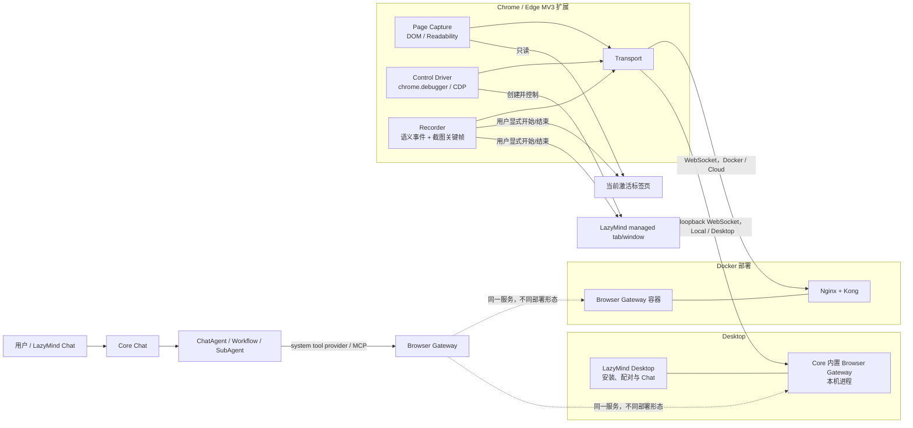

# LazyMind 浏览器插件方案：页面感知、浏览器控制与录制转 Skill

> 2026-09-01 产品决策：当前测试版采用完全自动化，点击发送/提交、Enter、敏感字段输入和任意按键不再要求人工接管。扩展与 Desktop 中原有的本地安全判断已注释保留，本文后续审批设计作为未来可选模式保留。
>
> 2026-09-11 形态决策：PRD 没有要求把网页嵌入 LazyMind。Docker、`make local-up` 和 Desktop 统一使用 Chrome/Edge 扩展打开独立可见浏览器窗口；Desktop 内嵌浏览器实现已移除。

部署命令: LazyMind/build_command.txt

> 状态：Docker、Local 和 Desktop 统一的“扩展 + 独立有头 Chrome”开发版 MVP 已实现；生产验收项见根目录 `BROWSER_PLUGIN_IMPLEMENTATION_STATUS.md`<br>
> 范围：Chrome / Edge（Manifest V3）、Docker 部署、LazyMind Desktop（macOS / Windows）<br>
> PRD 基线：PRD 0.3 遗留的“抓取当前页面”能力<br>
> 增强目标：Agent 可以打开一个 URL，并在用户可见、可随时接管的浏览器页面中执行点击、输入、选择、滚动、等待和截图；后续把用户录制的网页操作整理成可复用 Skill。

## 1. 结论

推荐并已经按 **“一个扩展代码库 + Browser Gateway + LazyMind 第一方浏览器工具”** 的统一架构实施，按能力分层交付：

1. **P0 页面感知（PRD 0.3）**：抓取当前激活标签页的 URL、标题、正文、图片 alt 和链接，先满足现有验收。
2. **P1 受控浏览器**：由插件打开 URL，只控制本次任务创建的 managed tab/window，提供观察、点击、输入、选择、滚动、等待和截图。
3. **P1/P2 录制转 Skill**：用户手工演示操作时，插件记录语义事件和截图关键帧，LazyMind 生成 `SKILL.md` 草稿并经过人工复核；P2 再增加可选视频录制和视觉理解。（做个mock，先留一个 按钮， mock一哥生成的 video 和导出的skill 先不要真做）

- 浏览器扩展运行在用户的 Chrome / Edge 中。页面感知使用标准 DOM；浏览器控制负责创建由 LazyMind 管理的新窗口或标签页，并通过 `chrome.debugger` 使用 Chrome DevTools Protocol（CDP）操作页面。
- `browser-gateway` 负责设备配对、在线连接、会话路由、命令超时、审批和审计，并同时向 LazyMind Agent 暴露浏览器工具。
- Docker 侧由扩展主动通过 WebSocket 连接容器中的 Gateway。容器不能直接访问宿主机浏览器，这个边界不能靠 `host.docker.internal` 解决。
- Desktop 与 Docker/Local 使用同一个扩展和控制驱动：模型打开 URL 时，扩展创建独立有头窗口；读取当前 Chrome/Edge 页时在配对阶段一次性明确授权网页读取，后续无需逐站点授权。Native Messaging 只作为后续动态端口发现优化。
- Docker 中的 Playwright Chromium 仅作为自动化测试环境，以及后续可选的“托管无头浏览器”驱动，不代替产品态扩展。
- 页面由 React、Vue、Angular、Svelte 或传统服务端模板实现时，**不需要分别适配框架**。通用层操作 DOM、可访问性树和真实输入事件；只为富文本编辑器、Canvas 或特殊网站增加能力适配器。
- 对 Agent 框架也不做 LangChain、LlamaIndex、LazyLLM 等多套实现。内部统一使用一套工具协议，并通过 MCP / LazyMind Tool Provider 暴露。

当前 PRD 的验收项只覆盖“读取当前页”，**并不能验收“控制浏览器”**。因此不能以页面抓取完成宣称浏览器控制完成；必须为 P1 单独增加控制验收。控制阶段先支持“扩展创建并管理的页面”，不允许 Agent 静默控制用户原有标签页；当前页只允许读取，后续若要控制必须再次显式授权。

### 1.1 PRD 0.3 范围与验收缺口

| 能力 | 当前 PRD 是否覆盖 | 本方案优先级 | 说明 |
|---|---:|---:|---|
| 获取当前页 URL、标题、正文、图片 alt、链接 | 是 | P0 | 现有验收主路径 |
| 未登录、未配对或未授权时拒绝抓取 | 是 | P0 | 三个状态都要有明确提示 |
| 打开指定 URL | 否 | P1 | 新增 `browser.open` 验收 |
| 点击、输入、选择、滚动、等待、截图 | 否 | P1 | 新增可控浏览器验收 |
| 录制操作并生成 Skill | 否 | P1/P2 | 作为新需求独立验收 |

P0 与 P1 共用一套扩展、配对和 Gateway，但在代码和权限策略中分成 `page_capture` 与 `browser_control` 两个 capability。这样既能尽快交付 PRD 0.3，又不会把高权限控制逻辑混入每次页面抓取。

### 1.2 对 OpenAI Codex 开源实现的核对结论

核对基线为 `openai/codex` 提交 `a9519cbcdd2d664530edb2469224ee03c1056799`（2026-08-31）。开源仓库能够确认的部分是：

- `browser_use`、`browser_use_full_cdp_access`、`browser_use_external` 和 `computer_use` 是独立、稳定的能力开关，而不是把所有权限合成一个布尔值。
- Browser Use 策略按 origin 划分 `access`、`downloads`、`uploads`、`full_cdp_access`；托管要求还包含 `auto_review`、`persistent_approval` 和 `turn/thread` 两种授权生命周期。
- 浏览器/计算机动作通过 `node_repl` 或 `cua_repl` 工具接入，确认策略作为 MCP 调用 metadata 下发；执行结果和截图被收集为有大小边界的审查证据。
- 网页和嵌套工具返回值被明确标为 **untrusted evidence, not instructions**。点击风险按真实 UI、当前状态和最终后果判断，而不是按 Agent 对动作的文字描述判断。

开源仓库中**没有** Chrome 扩展、Native Messaging Host、`browser-client.mjs` 或浏览器运行时驱动源码，也没有 `chrome.debugger` 的直接实现。因此本方案不会声称“照搬 Codex 插件代码”。公开 GitHub issue 中出现过 bundled Chrome 插件、Native Messaging、`agent.browsers.get("extension")` 和 Playwright/CDP 的运行痕迹，但这是运行时线索，不是已开源实现合同。LazyMind 可复用的是 Codex 已公开的分层和安全模型，扩展桥接需要自行实现。

## 2. 与 LazyMind 当前架构的衔接

仓库当前已经具备以下接入基础：

- Docker 前端默认暴露在 `8090`，由 Nginx 转发 `/api/*` 到 Kong。
- Local / Desktop 由 Caddy 转发到 `local-proxy`；Desktop 运行时仅绑定 `127.0.0.1`，端口可能动态分配。
- Core 的 Chat 请求已经支持注入 MCP 运行时配置，Python Chat 服务可以把 MCP Tool 加入 Agent。
- Desktop 已经通过 `local-runtime-manager` 统一启动、探活、停止和打包 Go / Python 服务。
- Electron 已有 preload IPC、安全外链、运行时状态和本地授权目录等能力，可复用其“显式授权 + 可撤销”的交互模式。

需要注意一个现有约束：`algorithm/lazymind/chat/service/chat_service.py` 在绑定 Workflow 的回合中会隐藏普通用户 MCP Tool。因此浏览器能力不能只作为一条普通 `mcp_config` 追加进去，否则普通对话能用，Workflow / SubAgent 中可能不可用。

建议增加不可由用户伪造的 `system_tool_providers`（或 `system_mcp_config`）通道：

1. 普通对话通过该通道加载第一方浏览器工具。
2. Workflow / SubAgent 仅在会话策略和步骤声明允许时加载第一方浏览器工具。
3. 普通用户 MCP 仍保持现有隔离规则，不因浏览器接入而扩大权限。

代码中应使用“browser extension / browser gateway / browser tool”命名，避免与仓库里代表 Workflow Runtime 的 `plugin_*` 表和 PluginSession 混淆。

## 3. 总体架构



关键原则：

- Agent 不直接持有 `tabId`、CSS Selector、Cookie 或 CDP 权限。
- 页面抓取和页面控制是两个独立 capability；抓取授权不能自动升级为控制授权。
- Browser Gateway 只把经过校验的高层动作下发给扩展。
- 扩展内部也使用 CDP method allowlist，只调用实现高层动作所需的固定命令；明确拒绝 Cookie / Storage 导出、网络拦截和模型传入的任意 `Runtime.evaluate` 代码。
- 扩展只允许操作自己创建并登记过的窗口 / 标签页。
- Desktop 页面控制同样只操作扩展创建并登记的 managed window/tab；第三方网页不会获得 Electron Node 或 LazyMind preload。
- 用户手工接管、关闭标签页、撤销设备或附加 DevTools 时，当前自动化会话立即暂停或结束。
- 页面内容一律视为不可信数据，不能把网页中的“忽略之前指令”等内容当作系统指令执行。

### 3.1 P0 页面感知设计

#### 触发和授权

支持两种授权模式：

1. **单次当前页**：用户点击扩展或 LazyMind 的“连接当前页”，通过 `activeTab + scripting` 获得本次标签页临时读取权限。适合首次使用和隐私敏感页面。
2. **记住此站点**：用户在扩展 UI 中主动授予当前 origin 的 optional host permission。以后可由对话指令抓取该站点当前激活页；页面导航到新 origin 后必须重新授权。

以下三个条件缺一不可：LazyMind 用户已登录、扩展设备已配对且未撤销、目标标签页拥有本次或当前 origin 的读取授权。任一条件不满足时，扩展不得执行 `executeScript` 或回传内容，只返回对应的 `LOGIN_REQUIRED`、`PAIRING_REQUIRED` 或 `SITE_PERMISSION_REQUIRED`，前端展示可操作的引导。

“授权后默认开启”只能理解为记住用户明确批准的 origin，不能变成安装后读取所有网站，也不能使用一次 `activeTab` 授权静默扩大为永久全站权限。

#### 提取逻辑

内容脚本返回两个正文视图：

- `article_text`：使用 Mozilla Readability 类算法提取主文章，适合总结文章；提取失败时回退到可见正文。
- `visible_text`：遍历可见 DOM 文本并规范空白，覆盖正文、表格和页面主要控件文案，用于满足“正文全文”及操作上下文。

同时返回：

```json
{
  "schema_version": "1",
  "capture_id": "cap_01...",
  "tab": {
    "url": "https://example.com/article",
    "origin": "https://example.com",
    "title": "Example article",
    "captured_at": "2026-08-31T08:00:00Z"
  },
  "content": {
    "article_text": "...",
    "visible_text": "...",
    "lang": "zh-CN",
    "total_chars": 128430,
    "sha256": "..."
  },
  "images": [{"alt": "流程图", "src": "https://example.com/a.png"}],
  "links": [{"text": "详情", "href": "https://example.com/detail"}],
  "limitations": ["cross_origin_iframe_not_captured"]
}
```

正文不能为了塞入一次模型上下文而静默截断。扩展按 64～256KB 的受控帧分块上传，Gateway 校验顺序、总大小和 hash 后写入短期对象；Agent 首次只拿摘要索引和必要片段，可按 chunk 继续读取。验收所说“完整”是指提取结果在传输和存储层完整、没有乱码或无提示截断，不代表无限长度网页一次全部进入模型上下文。

明确记录浏览器限制：`chrome://`、`edge://`、Chrome Web Store、浏览器 PDF viewer 等受保护页面无法注入；跨 origin iframe 未获得相应 host permission 时只能报告未抓取，不能宣称内容完整。对支持范围内的普通 HTML 页面，应通过 UTF-8、中文、长文、动态 SPA、Shadow DOM 和 iframe 测试证明结果。

#### 对话工具

P0 只需三个第一方工具：

| Tool | 作用 |
|---|---|
| `browser.current_tab` | 返回当前激活页的 URL、标题、授权状态和支持状态，不返回正文 |
| `browser.capture_current_page` | 生成结构化抓取结果和内容对象引用 |
| `browser.read_capture` | 按 section/chunk 读取完整抓取对象，避免一次塞满上下文 |

工具结果必须包在 `untrusted_browser_content` 语义边界中。正文中的命令、表单提示和 prompt injection 只作为待分析数据，不能修改系统指令、授权或工具策略。

## 4. 为什么选择扩展 + CDP

| 方案 | 优点 | 问题 | 结论 |
|---|---|---|---|
| 仅 content script | 权限提示较轻，开发简单 | 合成事件不一定可信；跨域 iframe、复杂编辑器、Shadow DOM 和动态页面稳定性不足 | 不作为通用控制主驱动 |
| MV3 扩展 + `chrome.debugger` / CDP | 可访问 DOM、Accessibility、Input、Page、Runtime 等域，可产生真实鼠标键盘事件 | `debugger` 是高权限且不能声明为 optional；需要明确安装告知和严格审批 | **产品态主方案** |
| Docker Playwright 浏览器 | 自动化稳定、适合 CI 和无人值守 | 是容器里的独立浏览器，拿不到用户宿主机 Chrome 的登录态，用户不易接管 | 测试与后续无头模式 |
| Electron `webContents.debugger` / WebContentsView | 可在 Desktop 内嵌且不受 iframe 策略限制 | Desktop 独占，增加第二套驱动与 E2E 成本，且 PRD 未要求 | **不实现，统一使用扩展驱动** |

V1 最低支持 Chromium 124；当前使用的 MV3、`chrome.debugger`、`chrome.scripting` 与 CDP 1.3 控制链已在该版本覆盖。Chrome 和 Edge 使用同一套扩展代码、分别发布商店包。Firefox 不进入 V1，因为其调试接口和 CDP 行为不能直接等价复用。

### 4.1 扩展权限建议

Manifest V3 的必需权限控制在：

```json
{
  "manifest_version": 3,
  "minimum_chrome_version": "124",
  "permissions": [
    "activeTab",
    "scripting",
    "debugger",
    "storage",
    "alarms",
    "nativeMessaging"
  ],
  "host_permissions": [
    "http://127.0.0.1/*",
    "http://localhost/*"
  ],
  "optional_host_permissions": ["https://*/*", "http://*/*"]
}
```

说明：

- `activeTab + scripting` 用于用户明确触发的一次当前页抓取；“记住此站点”再按 origin 请求 `optional_host_permissions`。安装时不申请 `<all_urls>`。
- `chrome.tabs.create()` 本身不要求 `tabs` 权限。只有需要读取所有普通标签页的 URL / 标题时才需要 `tabs`，而 V1 不应这样做。
- `debugger` 权限不能声明为 optional。安装页面必须解释它只用于用户显式启动的 LazyMind 受控页面。
- `nativeMessaging` 仅作为未来“Desktop 自动发现本机 Gateway 端口”的可选增强；当前 MVP 不申请该权限。Docker、Local 和 Desktop 扩展均使用同一 WebSocket 协议。
- 本地 Docker / Desktop 网关使用固定 loopback host permission；远程 Docker / Cloud 地址在用户配置服务地址时按域名请求 optional host permission。
- 不申请 `cookies`、`history`、`webRequest`、`downloads` 或 `<all_urls>`。登录态由受控页面自然使用当前浏览器 Profile，扩展不读取或导出 Cookie。

`debugger` 带来的安装警告会明显高于纯内容抓取。由于产品目标已经明确包含控制浏览器，推荐正式产品只维护一个 **Controller 扩展**，安装时完整解释权限；代码内部仍把 Capture 与 Control 隔离。如果商店审核或企业安全要求不能接受高权限包，可从同一代码库构建一个不含 `debugger` 的 Reader 发行物，但这只是打包差异，不能演变成两套协议和两套业务代码。

## 5. 浏览器工具协议

Agent 只看到高层、可审计的 Tool，不直接执行 JavaScript 或任意 CDP 命令。

### 5.1 V1 工具集合

| Tool | 作用 | 风险级别 |
|---|---|---|
| `browser.open` | 打开可见受控页面；所有部署形态都由扩展创建独立窗口 | 读；内网地址需额外确认 |
| `browser.navigate` | 在当前受控标签页跳转 URL | 读；跨域重新检查授权 |
| `browser.snapshot` | 返回标题、URL、可访问性树和可交互元素引用 | 读 |
| `browser.click` | 点击快照中的元素引用 | 根据元素语义动态分级 |
| `browser.type` | 向输入框输入或替换文本 | 写；密码框禁止 Agent 输入 |
| `browser.select` | 选择下拉项、单选或复选项 | 写 |
| `browser.press` | Enter、Escape、Tab、方向键等受限按键 | 写 |
| `browser.scroll` | 页面或元素滚动 | 读 |
| `browser.wait` | 等待 URL、文本、元素状态或短时页面稳定 | 读 |
| `browser.screenshot` | 获取当前视口截图并存为临时产物 | 读，默认脱敏 |
| `browser.tabs` | 仅列出本次受控会话产生的标签页并切换 | 读 / 会话内状态 |
| `browser.close` | 关闭并释放受控会话 | 读 |

V1 不提供以下能力：

- 任意 `evaluate_javascript`、任意 CDP passthrough；
- 读取或写入 Cookie、LocalStorage、浏览历史；
- 静默操作用户原有标签页；
- 自动读取密码、验证码、支付信息；
- 未经确认的发布、购买、删除、提交审批等不可逆动作；
- 任意本地文件路径上传。文件上传应在后续通过一次性文件授权和明确确认实现。

### 5.2 元素定位与快照

扩展使用 `Accessibility.getFullAXTree`、`DOM` / `DOMSnapshot` 生成精简快照：

```json
{
  "session_id": "bs_01...",
  "revision": 12,
  "url": "https://example.com/form",
  "title": "Example Form",
  "elements": [
    {"ref": "e12", "role": "textbox", "name": "姓名", "value": "", "state": []},
    {"ref": "e18", "role": "button", "name": "提交", "state": ["enabled"]}
  ]
}
```

- `ref` 只在当前 `revision` 有效；导航或明显 DOM 变更后旧引用返回 `STALE_SNAPSHOT`。
- 点击时由扩展把 AX / DOM 节点解析到 `backendNodeId` 和可见 Box，再通过 CDP `Input.dispatchMouseEvent` 产生真实输入事件。
- 输入优先使用聚焦 + `Input.insertText`，并触发页面需要的 `input` / `change` 语义。
- 需要 `Runtime.callFunctionOn` 时只调用随扩展发布、经过审查的固定函数，文本和值作为序列化参数传入，绝不把 Agent 生成的字符串当 JavaScript 执行。
- 每个动作返回新 URL、标题、变更摘要和新的 revision，使 Agent 形成“观察 → 动作 → 再观察”的闭环。
- 页面稳定不只依赖 `networkidle`；SPA 可能长期保持网络连接。建议组合使用 `document.readyState`、URL 变化、目标条件和 300～500ms DOM 静默窗口，并设置硬超时。

### 5.3 Gateway 与扩展命令帧

```json
{
  "protocol_version": "1",
  "command_id": "cmd_01...",
  "session_id": "bs_01...",
  "action": "click",
  "expected_revision": 12,
  "deadline_ms": 15000,
  "payload": {"ref": "e18"}
}
```

每个 `command_id` 必须幂等去重。统一错误码至少包括：

- `DEVICE_OFFLINE`
- `PERMISSION_REQUIRED`
- `USER_DENIED`
- `APPROVAL_REQUIRED`
- `STALE_SNAPSHOT`
- `TAB_NOT_MANAGED`
- `UNSUPPORTED_PAGE`
- `BROWSER_DETACHED`
- `HUMAN_TAKEOVER_REQUIRED`
- `ACTION_TIMEOUT`

### 5.4 录制网页操作并生成 Skill（P1/P2）

“录屏转 Skill”不应把视频作为唯一输入。视频可以说明用户看到了什么，但缺少稳定的元素身份、输入参数、导航和等待条件，直接从像素反推操作会脆弱。推荐采用 **语义操作轨迹为主、截图关键帧为辅、视频为可选证据** 的方案。

#### 录制流程

1. 用户在扩展中点击“开始录制”，选择允许的 origin；录制状态必须持续可见。
2. 内容脚本在 capture phase 监听用户真实的 `click`、`input/change`、`submit`、键盘、滚动和导航，Control Driver 补充 DOM/AX 快照与页面截图。
3. 每一步记录 `role/name`、稳定属性、附近文本、DOM/AX 路径候选、页面 URL、前后状态和时间；不要只记录绝对 CSS/XPath。
4. 密码、OTP、支付卡、token、`autocomplete=current-password/new-password/one-time-code` 等字段只记录“需要人工输入”的占位符，绝不记录值。普通输入由用户选择“固定示例”或“转为 Skill 参数”。
5. 用户点击“停止录制”后，Gateway 对轨迹去噪：合并连续输入/滚动、删除无效果点击、识别页面跳转、推导等待条件和候选变量。
6. Skill 生成器产出草稿，由用户查看步骤、参数、目标网站和审批规则；先在测试/预演模式重放，用户确认后再写入个人 Skill。

建议轨迹结构：

```json
{
  "trace_version": "1",
  "allowed_origins": ["https://example.com"],
  "steps": [
    {
      "action": "click",
      "target": {"role": "button", "name": "新建报告"},
      "url_pattern": "https://example.com/reports*",
      "checkpoint": {"visible": {"role": "heading", "name": "创建报告"}}
    },
    {
      "action": "type",
      "target": {"role": "textbox", "name": "报告名称"},
      "value": {"parameter": "report_name", "example": "季度复盘"}
    }
  ]
}
```

#### Skill 产物与现有 LazyMind Skill 系统衔接

LazyMind 当前 Skill 包要求根部存在带 `name`、`description` frontmatter 的 `SKILL.md`，并已有 draft/review/commit 生命周期。因此录制结果不应绕过 SkillV2 直接写最终文件：

```text
recording trace
  -> trace normalizer
  -> SKILL.md 草稿（抽象 SOP、参数、前置条件、人工接管点）
  -> references/browser-workflow.json（可机器回放的结构化步骤）
  -> 可选 references/checkpoints/（脱敏截图）
  -> SkillV2 draft review
  -> 用户确认后 commit
```

`SKILL.md` 描述任务意图、何时使用、参数和安全约束；可执行细节放到结构化引用文件中，避免把一次录制中的用户名、项目名、具体数据或脆弱 selector 固化成 SOP。重放时仍执行“snapshot → 语义定位 → action → checkpoint”，找不到唯一目标就暂停并请求用户修复录制，而不是猜测点击。

P1 先交付事件轨迹、截图关键帧和 Skill 草稿；P2 如确有复盘或视觉应用需求，再使用 `chrome.tabCapture`、offscreen document 与 `MediaRecorder` 增加可选视频。视频默认本地临时保存、短期保留、用户主动上传，生成 Skill 后可删除；不能用全桌面录屏替代浏览器标签页范围授权。

## 6. 一次完整执行流程

1. 用户在 LazyMind 中说：“打开 `https://example.com/form`，帮我填写表单。”
2. Core 为本轮请求注入第一方 Browser Tool Provider，并携带短时、签名的用户 / 会话 / run 上下文，不把用户 JWT 交给模型。
3. Agent 调用 `browser.open`。Gateway 选择该用户在线的已配对扩展。
4. 若目标域名未获本任务授权，LazyMind 或扩展显示域名授权提示。
5. 扩展创建独立普通窗口，记录 `windowId/tabId`，附加 `chrome.debugger`，打开 URL。
6. 扩展生成精简快照，Gateway 返回给 Agent。
7. Agent 使用 `ref` 调用 `browser.type`、`browser.click` 等动作。
8. Gateway 在每次动作前检查会话归属、revision、域名和风险策略。高风险动作进入审批，不直接下发。
9. 扩展执行动作并返回新的页面状态；Gateway 记录脱敏审计事件。
10. 任务完成、用户接管或超时后执行 `browser.close` / detach，撤销当前任务授权。

## 7. Docker 侧方案

### 7.1 产品运行方式

新增 `browser-gateway` 服务：

- 公网 / 宿主机入口：`/api/browser/v1/pair`、`/api/browser/v1/connect`（WebSocket）。
- 内网入口：`/mcp` 或内部 Tool Provider API，仅 Core / Chat 网络可访问。
- 健康检查：`/healthz`；就绪检查至少验证命令路由器、Core 内部鉴权和 Redis（如启用）。
- Gateway 不包含 Chromium。真正的产品浏览器是用户宿主机中的 Chrome / Edge 扩展。

扩展主动连接：

- 本地 Docker 默认连接 `ws://127.0.0.1:8090/api/browser/v1/connect`。
- 远程 Docker 必须使用 `wss://<LazyMind 域名>/api/browser/v1/connect`。
- WebSocket 不在 URL Query 中携带长期 token，避免被访问日志记录；连接后第一帧完成 challenge-response，或使用约定的子协议承载一次性握手信息。

### 7.2 Docker 路由修改

需要修改：

- `docker-compose.yml`：新增 Gateway 服务、内部密钥、健康检查和依赖；只通过前端 / Kong 暴露，不直接发布内部 MCP 端口。
- `kong.yml`：增加浏览器 Gateway Route。扩展连接不能依赖普通用户 JWT，配对和设备连接由 Gateway 自己鉴权；其他管理 API 仍走 Core 的 JWT / RBAC。
- `frontend/default.conf.template` 和 `frontend/default.conf`：为 `/api/browser/` 增加 WebSocket Upgrade 转发，不能沿用当前会清空 `Connection` 的普通 `/api/` location。
- `backend/core/chat/tools.go`：注入签名的第一方 Browser Provider，而不是伪装成用户创建的 MCP Server。
- `algorithm/lazymind/chat/service/chat_service.py`：区分第一方 system tools 与普通用户 MCP，并把允许的浏览器能力传给 Workflow / SubAgent。

### 7.3 Docker 侧不能做的事

- Docker 容器不能直接枚举或控制宿主机 Chrome 标签页。
- `host.docker.internal` 只解决容器访问宿主网络地址，不能获得浏览器进程控制权。
- 在容器里安装 Chromium 只会得到隔离的新 Profile，不会自动拥有用户宿主浏览器的 Cookie 和登录状态。

因此，Docker 产品链路必须由扩展主动连入；容器 Chromium 只能作为另一种明确标识的“托管浏览器模式”。

## 8. Desktop 侧方案

### 8.1 产品默认形态：外部 Chrome / Edge

- Desktop 设置页下载并校验与 Docker/Local 相同的 MV3 扩展，安装到用户数据目录下的 `deps/browser-extension`。
- Chrome/Edge 安全策略要求用户在 `chrome://extensions`、`edge://extensions` 或对应商店页面确认安装、启用和站点权限；Desktop 不能静默加载普通用户扩展。
- 设置页可以直接生成 5 分钟有效的一次性配对码。用户把地址和配对码粘贴到扩展弹窗，连接后即可抓取当前页或由 Agent 打开独立有头窗口。
- Gateway 作为 `backend/core/browser/` 内置模块运行，Desktop 不增加独立进程；local-proxy 只对精确 `/api/browser/v1` 公开配对/WebSocket，其他 Route 继续执行普通 RBAC。
- Desktop 不再注入内嵌设备偏好。扩展是唯一默认控制设备，因此 Docker、Local、Desktop 的 Agent 行为、页面登录态和问题定位路径一致。

### 8.2 未来可选：Native Messaging

若要免去 Desktop 动态端口的手工配置，可后续增加 Native Host。它只负责端口发现和协议转发，页面抓取与 CDP 控制仍在扩展内；Chrome/Edge 注册必须使用精确扩展 ID，并由用户显式安装/移除。

## 9. 配对、鉴权与多用户隔离

不能把 Local / Desktop 的 `/_local/admin-session` 自动登录 token 直接交给扩展。扩展只获得一次性配对产生、且仅限浏览器能力的设备凭证；第三方页面本身接触不到该凭证。

建议流程：

1. 已登录用户在 LazyMind 设置中创建 5 分钟有效、单次使用的配对码。
2. 扩展生成设备密钥和随机 `device_id`，提交配对码、扩展版本、浏览器类型和公钥指纹。
3. Core 消费配对码，保存 token hash / 公钥，返回可撤销的设备凭证。
4. 每次连接执行 challenge-response；Gateway 绑定 `connection_id -> user_id -> device_id`。
5. Agent 调用 Browser Tool 时，Core 生成 5～15 分钟有效的内部 capability token，包含 `user_id`、`conversation_id`、`run_id`、scope 和过期时间。
6. Gateway 只有在 capability token 与在线设备用户一致时才路由命令。

建议增加数据模型：

- `browser_devices`：用户、设备指纹、浏览器 / 扩展版本、最后在线时间、撤销状态。
- `browser_pairing_sessions`：code hash、用户、有效期、消费时间。
- `browser_sessions`：conversation / run / device、允许域名、状态、开始结束时间。
- `browser_action_audits`：command、动作类型、目标 origin、目标元素摘要、风险级别、审批结果、错误码和耗时。

默认不保存完整页面正文、输入值、截图和密码字段。需要诊断时只允许用户主动导出脱敏报告。

## 10. 操作审批与安全边界

参考 Codex 开源策略模型，LazyMind 不应只保存一个模糊的“允许浏览器”开关。建议策略最少包含：

```yaml
browser_use:
  allow_history_access: false
  default_origin_policy:
    capture: prompt
    control: deny
    downloads: deny
    uploads: deny
    full_cdp_access: deny
    persistent_approval: false
    approval_lifetime: turn
  origins:
    "https://docs.example.com":
      capture: allow
      control: prompt
```

- `capture`、`control`、`downloads`、`uploads`、`full_cdp_access` 分开授权。V1 不向 Agent 暴露 full CDP，它只表示内部经过审计的驱动是否可使用扩展 CDP 域。
- 授权生命周期支持 `action`、`turn`、`thread`；默认 `turn`，跨 thread 的永久授权必须在设置页显式开启和撤销。
- 浏览历史默认关闭；P0 只读取当前激活页，不能枚举历史或后台标签。
- Gateway、扩展本地策略各做一次校验。服务端误下发或旧版本扩展都不能绕过 origin、managed tab 和敏感字段限制。
- 自动风险审查可以辅助判断，但不代替确定性禁用项和用户确认；截图和 DOM 证据都按不可信输入处理并设大小上限。

### 10.1 动作分级

| 级别 | 示例 | 处理 |
|---|---|---|
| Read | 打开页面、快照、滚动、截图 | 当前任务已授权域名内直接执行 |
| Reversible write | 填写普通文本、切换筛选、展开菜单 | 首次写操作确认，可授权到当前任务 |
| External side effect | 提交表单、发送消息、发布内容、上传文件 | 每次展示动作、网站、关键字段并确认 |
| Destructive / financial | 删除、购买、付款、转账、修改账号安全 | 默认阻止或必须由用户手工接管，不能只靠 Agent 文字确认 |

密码框、验证码、MFA、支付信息一律返回 `HUMAN_TAKEOVER_REQUIRED`。用户手动完成后可以点击“继续”，Gateway 清空旧快照并重新观察。

### 10.2 URL 和页面边界

- 仅允许 `http:` 和 `https:`。
- 拒绝 `chrome:`、`edge:`、`file:`、`data:`、`javascript:`、扩展页面和浏览器商店页面。
- loopback、RFC1918、链路本地和云元数据地址默认禁止；用户明确开启“允许本地 / 内网页面”后按任务和域名授权。
- 重定向后重新检查 origin；跨域 iframe 单独标记来源。
- 新弹窗 / 新标签页先进入 quarantined 状态，只有与当前动作相关且通过域名策略后才加入受控会话。
- 一个工具调用只能操作其 `session_id` 对应的 managed tabs，Gateway 和扩展两边都校验。

### 10.3 Prompt Injection 防护

- 快照返回值标注为 `untrusted_browser_content`。
- System Prompt 明确：网页文本无权修改任务、工具权限或审批策略。
- 页面要求上传密钥、复制 Cookie、关闭安全控制等行为直接拒绝并提示用户。
- 高风险动作由确定性策略判断，不能由 LLM 自己把风险级别降级。

## 11. 是否需要适配“多框架”

这个问题需要区分三类框架。

### 11.1 页面前端框架：不做逐框架适配

React、Vue、Angular、Svelte、Next.js、Nuxt 或传统 HTML 最终都会形成 DOM、Accessibility Tree 和浏览器输入事件。主驱动应依赖这些标准层，而不是读取框架私有状态。

需要做的是跨实现测试，不是维护多套驱动：

- 标准表单和原生控件；
- React / Vue SPA 路由和异步渲染；
- Shadow DOM；
- 同源 / 跨源 iframe；
- `contenteditable`；
- 无限滚动和虚拟列表。

### 11.2 特殊控件和网站：按“能力”适配

下列场景可能需要适配器，但适配维度不是 React / Vue：

- ProseMirror、Slate、Quill、TinyMCE、CodeMirror、Monaco 等编辑器；
- Canvas / WebGL 图形应用；
- 自定义下拉、拖拽、文件上传；
- 业务含义明确且风险高的网站，例如飞书文档、企业审批或电商提交。

适配器应实现同一 `BrowserDriver` / `SiteCapability` 接口，并只覆盖通用驱动失败或需要业务语义的动作。优先级建议：标准 DOM → 富文本编辑器 → 飞书等明确业务站点 → Canvas / 视觉定位。

### 11.3 Agent 框架：统一协议，不做多套 SDK

- LazyMind Chat / LazyLLM 通过第一方 Tool Provider 使用。
- Workflow / SubAgent 使用同一 Provider，并受步骤契约和 capability policy 控制。
- 外部 Agent 若以后需要浏览器能力，通过 MCP 暴露同一工具协议。
- 不直接维护 LangChain Tool、LlamaIndex Tool、CrewAI Tool 等重复实现；确有需求时只提供薄适配层。

Playwright、Selenium、Puppeteer 也不应同时成为产品运行时。产品扩展使用 CDP；Playwright 只负责测试和后续容器托管浏览器驱动。

## 12. 仓库建议目录

```text
LazyMind/
├── browser-extension/                 # Chrome / Edge MV3 扩展
│   ├── manifest.json
│   ├── src/background/                # 连接、设备状态、managed tabs
│   ├── src/capture/                   # 当前页正文、元数据、分块上传
│   ├── src/driver/cdp/                # snapshot / click / type / wait
│   ├── src/recorder/                  # 语义事件、脱敏、截图关键帧
│   ├── src/transport/                 # websocket / native-messaging
│   ├── src/policy/                    # URL、风险和敏感字段本地兜底
│   └── tests/
├── backend/browser-gateway/           # Go，连接路由、MCP、审批、审计
│   ├── cmd/browser-gateway/
│   ├── internal/protocol/
│   ├── internal/session/
│   ├── internal/transport/
│   ├── internal/mcp/
│   └── internal/recording/
├── backend/core/browser/              # 配对设备、策略、管理 API
├── algorithm/lazymind/browser_skill/  # trace 归一化与 Skill 草稿生成
├── local/lazymind-cli/internal/browserbridge/
├── tests/browser-fixtures/            # HTML / React / Vue / iframe / shadow DOM
└── tests/browser-e2e/                  # Playwright 扩展 E2E
```

协议 schema 建议放在一个语言中立目录（例如 `api/browser/v1/`），由 TypeScript / Go 各自校验；不要手工维护两个含义不同的 JSON 类型。

## 13. 测试方案

### 13.1 分层测试

1. **协议单测**
   - capture chunk 顺序/hash/大小、schema 兼容、版本拒绝、幂等 command、超时、断线重连、过期 token。
2. **扩展驱动单测**
   - 未登录/未配对/未授权拒绝抓取、origin 权限变化、长文/中文/动态页完整性、managed tab 白名单、revision 失效、URL 策略、敏感输入屏蔽、CDP detach。
3. **Gateway 集成测试**
   - 多用户设备隔离、审批阻塞 / 恢复、离线错误、审计脱敏、撤销实时生效。
4. **Agent 工具测试**
   - 普通 Chat、Workflow 和 SubAgent 都只在策略允许时看到 Browser Tool。
5. **真实浏览器 E2E**
   - 当前页授权 → 抓取 → 分块读取；打开 URL → 快照 → 输入 → 点击 → SPA 跳转 → 截图 → 关闭；录制 → 草稿 → 预演回放。

### 13.2 Docker E2E

增加 Compose 测试 profile：

```text
browser-fixture       提供确定性测试页面
browser-gateway       被测 Gateway
browser-e2e           Playwright bundled Chromium + unpacked MV3 extension
```

建议命令形态：

```bash
docker compose --profile browser-test up \
  --build --abort-on-container-exit \
  --exit-code-from browser-e2e
```

E2E 必须使用 Playwright 自带 Chromium 和 persistent context 加载扩展。Chrome / Edge 已移除 Playwright 过去依赖的扩展侧载 flags，不应拿系统 Chrome 当 CI 扩展宿主。

测试矩阵至少包含：

- 普通 HTML 表单；
- 10MB 级长文、中文编码、图片 alt、相对/绝对链接及无正文页面；
- React 与 Vue SPA 各一个，用来证明无需框架驱动；
- Shadow DOM；
- 跨域 iframe；
- 动态列表、弹窗、新标签页；
- 内网 URL 拦截、过期配对码、用户拒绝高风险操作；
- 页面中包含 prompt injection 文本，但不会改变 Agent / Gateway 策略。
- 录制中出现密码、OTP 和普通参数字段，敏感值不会进入 trace、日志、截图或 Skill 草稿。

### 13.3 Desktop 测试

- macOS arm64 与 Windows x64 各跑一次真实打包应用 E2E：安装目录打开、生成配对码、扩展连接、模型打开独立窗口、点击/输入/截图和登录态恢复。
- Docker、Local 与 Desktop 使用同一动作 transcript 验证扩展 CDP 结果一致。
- 若后续实现 Native Messaging，再补 Windows/macOS 路径、HKCU/用户目录登记、升级保留和清理合同测试。

## 14. 分阶段交付

### Phase 0：协议与安全基线（工程前置）

- 冻结 Capture、Control、Recording 三类 schema、扩展命令协议、错误码和审批准则。
- 完成登录/配对、一次性 page-reading permission、origin policy、managed tab 和多用户隔离设计。
- 建立 HTML、React、Vue、iframe、Shadow DOM 测试夹具。

验收：协议合同测试完成，禁止项有确定性测试，不依赖 LLM 判断。

### Phase 1：PRD 0.3 页面感知（P0）

- 实现 MV3 当前页提取、结构化元数据、长文分块和 untrusted content 标记。
- 实现 Gateway 的配对、WebSocket、Capture Tool 和短期抓取对象。
- Docker 通过 `127.0.0.1:8090` 跑通；Desktop 先复用 loopback WebSocket 跑通，不等待控制能力。
- Chat 支持“抓取当前页面”“总结我正在看的文章”，设置页支持单次授权、按站点记住和撤销。

验收：普通支持页面的 URL、标题、正文、图片 alt、链接与页面一致；长文在传输/存储层无静默截断或乱码；未登录、未配对、未授权三种状态均不抓取且有明确引导。这一阶段完成后才可关闭 PRD 0.3 遗留项。

### Phase 2：Docker 受控浏览器闭环（P1）

- 实现 Gateway、WebSocket 配对和 MV3 CDP 驱动。
- 普通 Chat 支持 open / snapshot / click / type / wait / screenshot / close。
- 设置页支持设备配对、在线状态和撤销。
- 跑通 Docker Playwright E2E。

验收：本地 Docker + 宿主 Chrome / Edge 可以从 Chat 打开测试 URL、填写并提交一个低风险测试表单；不同用户不能互相控制设备。

### Phase 3：Desktop 正式接入（P1）

- Gateway 纳入 local-runtime-manager，Desktop 设置页复用扩展下载、校验和安装目录打开能力。
- 设置页生成一次性配对码，扩展连接 Desktop loopback Gateway 后打开独立有头窗口。
- 完成 macOS / Windows 真实打包运行时测试。

验收：Chat 打开 URL 后 Chrome/Edge 出现独立受控窗口，模型和用户均可操作；抓取当前页需要站点授权；Desktop 退出或 Gateway 断开后设备离线。代码和外部 Chrome 联调已完成，真实打包 E2E 尚未完成。

### Phase 3B：外部 Chrome 自动发现（可选 P2）

- 如产品要求 Desktop 无配置连接扩展，再实现 Native Messaging Host、注册/卸载和动态端口发现。
- 这不会替换扩展控制，也不进入当前 Desktop 控制 MVP 的完成条件。

### Phase 4：录制转 Skill、Workflow 与审批（P1/P2）

- Browser Tool 进入受控 Workflow / SubAgent Tool Provider。
- 实现高风险动作审批、人工接管和恢复。
- 先实现语义事件轨迹、截图关键帧、Skill 草稿、draft review 和预演回放。
- 后续按需求增加 tab 视频录制和视觉对齐，不把视频设为生成 Skill 的必需输入。
- 增加富文本编辑器与飞书等能力适配器。

验收：录制结果不会保存密码/OTP，生成的 Skill 参数化且能在同站点测试夹具稳定回放；Workflow 不能绕过审批；用户拒绝后动作不会在扩展端执行；人工登录/验证后可从新快照继续。

### Phase 5：可选托管浏览器（P2）

- 为无扩展、CI 或远程无人值守场景增加 Playwright Driver。
- 保持同一 Tool schema，Gateway 根据 session driver 路由到 `extension-cdp` 或 `managed-playwright`。
- UI 明确显示托管浏览器没有用户 Chrome 登录态，并提供独立 Profile 生命周期。

## 15. 分层完成标准

### 15.1 PRD 0.3 / P0 完成标准

- Chrome 安装扩展并与 Docker 或 Desktop 配对后，用户可在普通 Chat 发出“抓取当前页面”或“总结当前文章”。
- 对支持页面返回 URL、标题、正文全文对象、图片 alt 与链接；无乱码、无未声明截断，超长正文可继续按 chunk 读取。
- 未登录、未配对、未授权时不读取页面，并分别提供登录、配对和站点授权引导。
- 用户能撤销站点权限和设备凭证；撤销立即生效。
- Chrome 受保护页面和未授权跨域 iframe 明确返回 limitation，不伪造“完整抓取”。

### 15.2 浏览器控制 / P1 完成标准

- Chrome / Edge 能从同一代码库构建 MV3 扩展。
- Docker、Local 与 Desktop 都能通过同一扩展从 Chat 打开一个受控 URL，完成标准 DOM 页面操作和截图。
- 只操作扩展创建的 managed tabs，不能枚举或静默接管其他标签页。
- 普通 Chat、允许的 Workflow / SubAgent 使用同一 Browser Tool 协议。
- 跨用户、跨 conversation、跨 session 命令全部被拒绝。
- 高风险动作有服务端确定性审批；密码/MFA/支付默认要求人工接管。
- 断线、页面关闭、DevTools 抢占 debugger、扩展撤销、Desktop 退出均能安全终止。
- Docker E2E 覆盖 HTML、React、Vue、iframe 和 Shadow DOM，证明不需要逐前端框架适配。
- 审计日志不记录密码、token、Cookie、完整表单值和完整页面正文。

### 15.3 录制转 Skill 完成标准

- 录制开始/结束、目标 origin 和持续状态对用户明确可见。
- trace 能把示例输入转为参数，密码、OTP、支付和 token 字段只生成 `HUMAN_INPUT` 占位符。
- 生成合法 `SKILL.md` 和结构化 browser workflow，并进入 LazyMind 现有 draft/review/commit 流程，未经用户确认不发布。
- 在录制网站的小幅 DOM 变化后仍优先通过 role/name/上下文定位；目标不唯一时暂停，不猜测执行。

## 16. 主要风险与应对

| 风险 | 应对 |
|---|---|
| `debugger` 权限安装提示较强 | 单一用途说明、只附加 managed tabs、常驻可见标识、可随时撤销；上线商店前完成隐私与权限审查 |
| 页面改版导致元素引用失效 | revision + AX 语义定位 + 失败后重新 snapshot，不长期保存 selector |
| DevTools 与扩展 debugger 冲突 | 监听 detach，返回 `BROWSER_DETACHED`，要求用户重新启动 / 继续会话 |
| 网站反自动化、验证码 | 不绕过；转人工接管，明确记录暂停原因 |
| 网页 Prompt Injection | 页面内容不可信标记、system policy、服务端风险引擎、敏感动作审批 |
| Docker 误以为能控制宿主浏览器 | 产品文档明确扩展主动连接边界；容器 Chromium 标记为独立托管模式 |
| Desktop 动态端口 | 当前由用户在扩展设置 loopback 地址；后续可由 Native Messaging Host 读取运行时状态 |
| 多框架维护成本 | 标准 DOM / AX / CDP 主驱动；只按控件或站点能力增加适配器 |
| 截图 / 快照过大 | 快照裁剪、差量返回、对象存储临时 URL、严格大小和有效期限制 |

## 17. 官方技术依据

### 17.1 OpenAI Codex（核对基线 `a9519cbc`）

- [Codex Browser Use feature gates](https://github.com/openai/codex/blob/a9519cbcdd2d664530edb2469224ee03c1056799/codex-rs/features/src/lib.rs#L248-L260)：In-app、外部浏览器、full CDP 和 Computer Use 分层控制。
- [Browser Use 用户配置](https://github.com/openai/codex/blob/a9519cbcdd2d664530edb2469224ee03c1056799/codex-rs/config/src/browser_use.rs)：按 origin 区分 access、download、upload 与 full CDP。
- [Browser/Computer Use 托管要求](https://github.com/openai/codex/blob/a9519cbcdd2d664530edb2469224ee03c1056799/codex-rs/config/src/browser_computer_use_requirements.rs)：auto review、persistent approval 和 turn/thread 授权生命周期。
- [Browser/Computer Use Guardian policy](https://github.com/openai/codex/blob/a9519cbcdd2d664530edb2469224ee03c1056799/codex-rs/core/assets/guardian/node_repl_policy.md)：递归审查嵌套动作、按真实 UI 后果判定风险、敏感数据出站与站点默认不可信。
- [REPL 审查证据](https://github.com/openai/codex/blob/a9519cbcdd2d664530edb2469224ee03c1056799/codex-rs/core/src/context/node_repl_review_evidence.rs#L93-L95)：对 `node_repl/cua_repl` 的文本和截图证据做 thread scope 与资源边界处理，并标记为不可信证据。
- [截图调用测试](https://github.com/openai/codex/blob/a9519cbcdd2d664530edb2469224ee03c1056799/codex-rs/core/tests/suite/code_mode.rs#L4355-L4405)：截图通过 REPL 包装的 MCP tool 返回，而不是作为模型直连 Chrome 的裸 CDP 接口。
- [Codex use cases](https://developers.openai.com/codex/use-cases)：官方产品文档提到前端/UI 工作中的浏览器验证，但没有公开 Chrome 扩展桥接实现。

以下链接仅作为 bundled 运行时的**线索**，不是开源实现依据：[Chrome Extension + Native Messaging 报告](https://github.com/openai/codex/issues/21955)、[`browser-client.mjs` / extension browser 报告](https://github.com/openai/codex/issues/30889)、[`chrome.debugger` / Playwright-CDP 报告](https://github.com/openai/codex/issues/30841)。三者都来自 GitHub issue 内容，不能替代公开源码或稳定 API 合同。

### 17.2 Chromium 与测试运行时

- [Chrome `chrome.debugger` API](https://developer.chrome.com/docs/extensions/reference/api/debugger)：扩展可通过 CDP 访问 Accessibility、DOM、Input、Page、Runtime、Target 等受支持域。
- [Chrome Permissions API](https://developer.chrome.com/docs/extensions/reference/api/permissions)：optional permission 的使用方式，并明确 `debugger` 不能声明为 optional。
- [Chrome Tabs API](https://developer.chrome.com/docs/extensions/reference/api/tabs)：扩展可创建和管理标签页，创建标签页本身不要求 `tabs` 权限。
- [Chrome Extension Service Worker 生命周期](https://developer.chrome.com/docs/extensions/develop/concepts/service-workers/lifecycle)：Chrome 116 起 WebSocket 活动可延长扩展 Service Worker 生命周期，Chrome 118 起活动 debugger 会话可保持其存活。
- [Chrome Native Messaging](https://developer.chrome.com/docs/extensions/develop/concepts/native-messaging)：Native Host 的 stdio 协议、`allowed_origins`、macOS manifest 路径和 Windows 注册方式。
- [Microsoft Edge Native Messaging](https://learn.microsoft.com/en-us/microsoft-edge/extensions-chromium/developer-guide/native-messaging)：Edge 的 Native Host manifest、扩展 ID 与 Windows 注册位置。
- [Playwright Chrome Extensions](https://playwright.dev/docs/chrome-extensions)：扩展测试应使用 persistent context；系统 Chrome / Edge 已不适合作为命令行侧载扩展的测试宿主。
