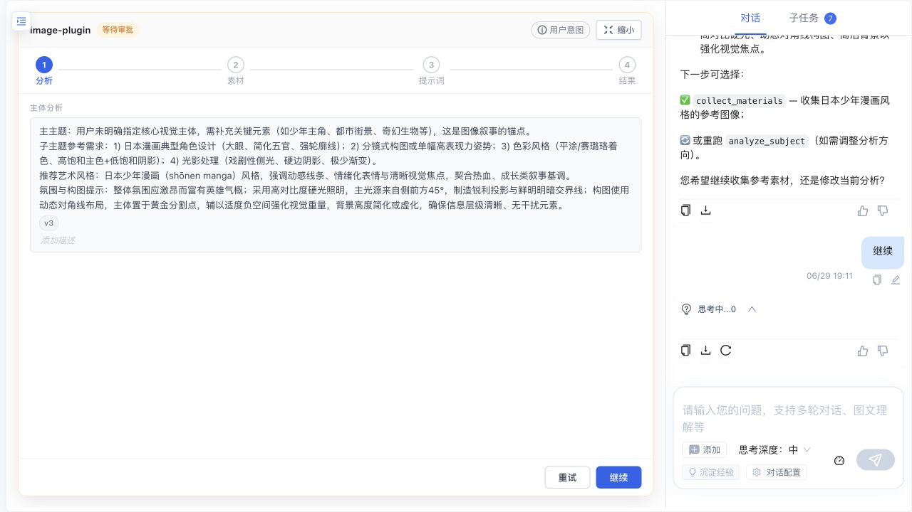
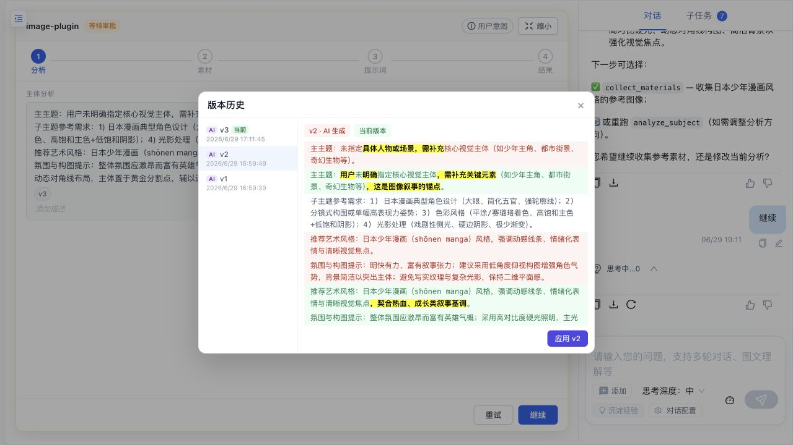
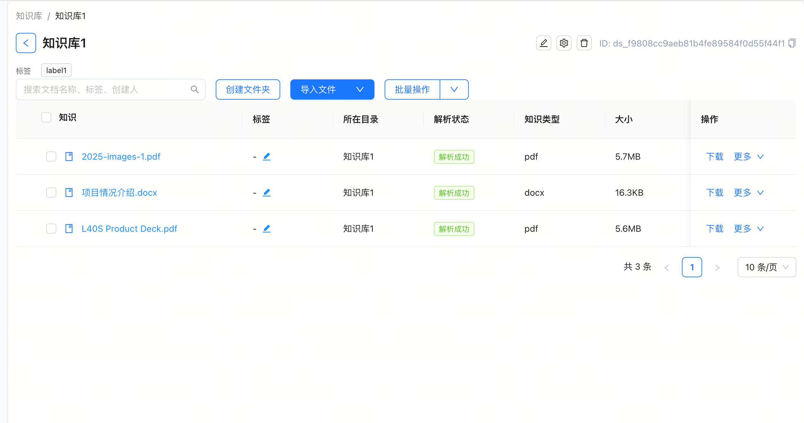
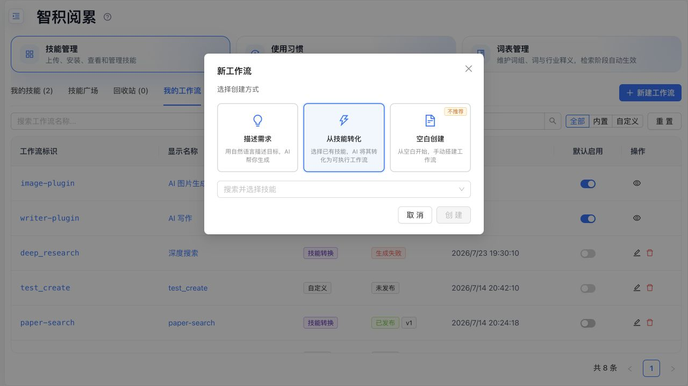
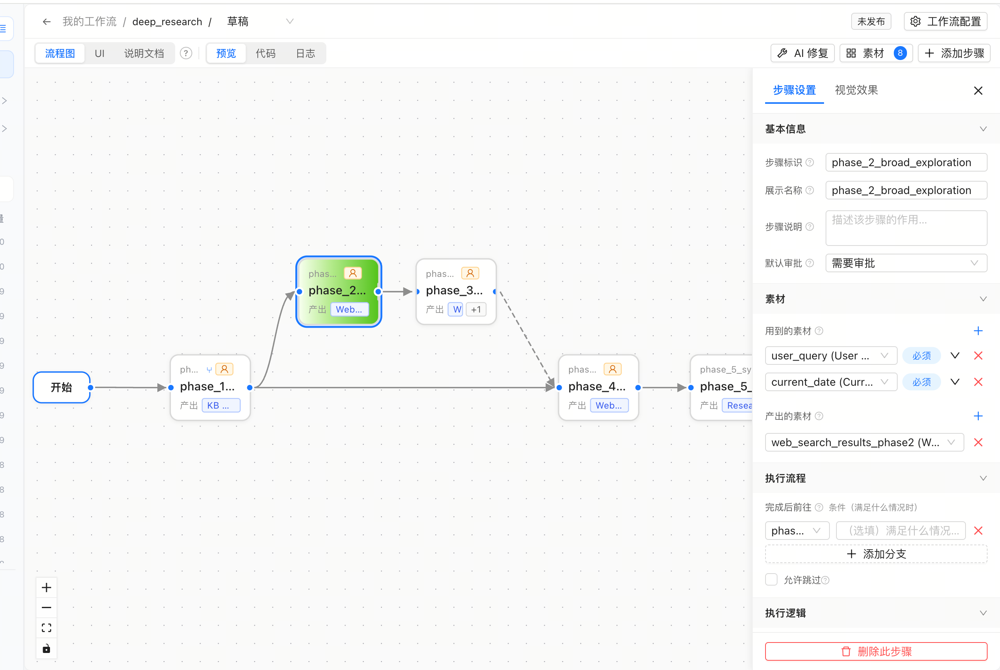
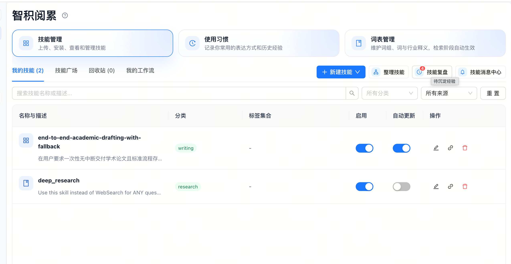
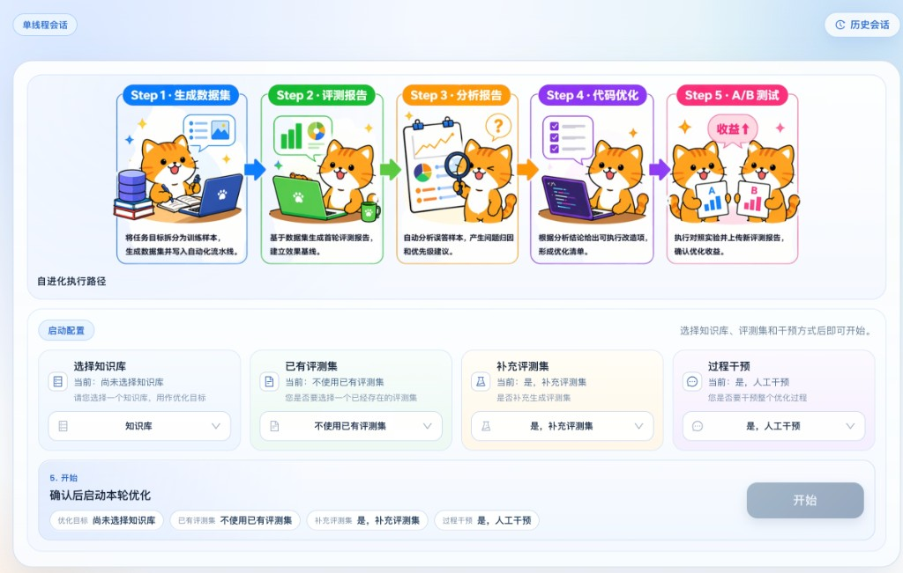
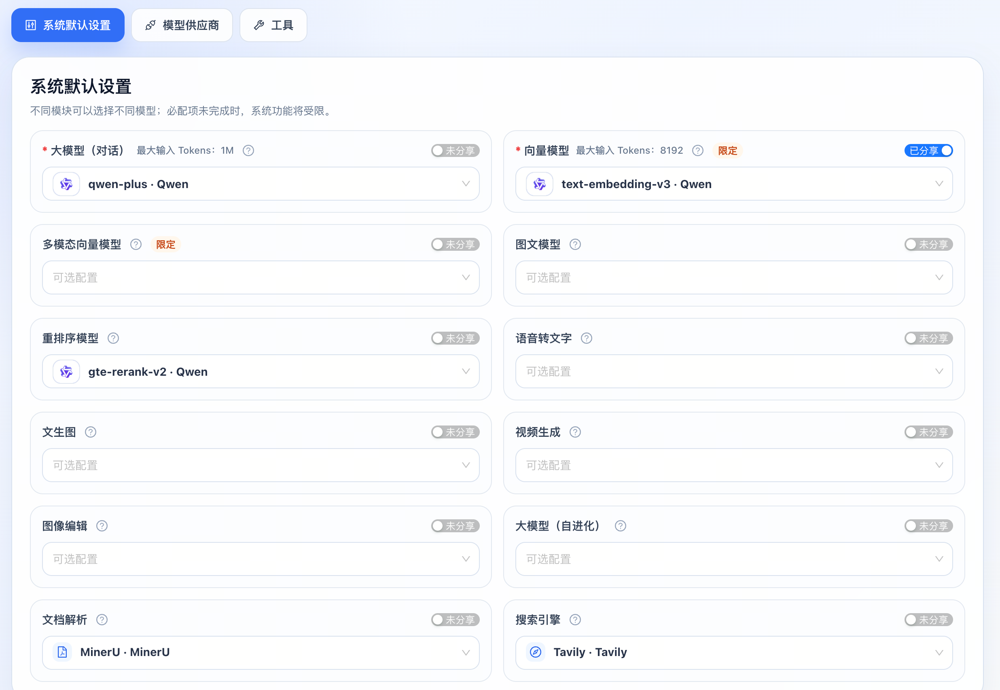
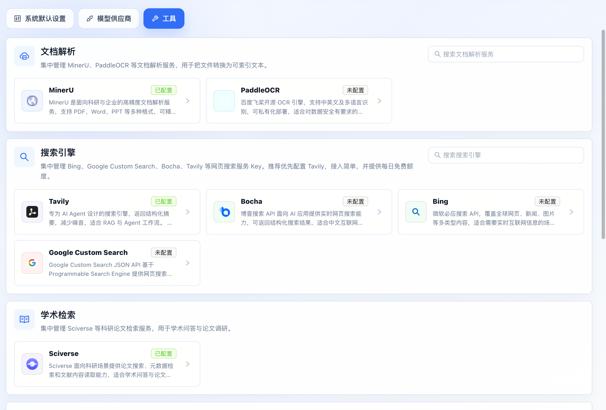

# LazyMind

[English](README.md) | **中文**

> **让 AI 按照你的资料、标准和偏好，稳定完成真实任务。**

<a id="block-user-17da33ac-c870-4c36-9dd4-398166f37e60"></a>

<a id="block-user-6972d837-824b-43f4-817c-f980bc9c44da"></a>

<a id="block-user-70fe97e5-dc96-4633-929d-e3d0a757dd9e"></a>

<a id="block-user-5c9d719f-f502-4974-9ccf-55fa0e0b4873"></a>

<a id="block-user-87be935e-c2db-40d2-80ef-a81582b0b858"></a>


LazyMind 是面向知识密集型工作的 **AI Skill Runtime**。它在同一个工作台里连接可复用知识、可执行 Skill、可观测工作流、可编辑产物与评测驱动的持续改进。

你不必反复上传资料、调 Prompt 或全程盯着 Agent：选择一次知识与工作流，LazyMind 会继续规划、执行、展示中间结果，并把经过确认的反馈带到下一次任务中。既可以通过 **Desktop Mode** 在本机使用，也可以部署为团队共享的企业服务。

[快速开始](#快速开始) · [产品架构](docs/architecture.md) · [构建工作流](docs/plugin-format.md) · [桌面模式](desktop/README.md)

***

<a id="block-user-67543bb3-2e2c-408c-ae1f-3197f4574410"></a>
## 它能交付什么？

表1

表1

表1

| 场景            | LazyMind 执行                          | 你获得                          |
| ------------- | ------------------------------------ | ---------------------------- |
| **调研与评审**     | 搜索资料 → 检索证据 → 对比 → 综合 → 审阅           | 基于内部资料与外部来源、过程可追溯的报告         |
| **AI Writer** | 整理素材 → 生成大纲 → 分章节写作 → 修改 → 终审        | 可编辑、有版本记录的文档，而不是一次性回答        |
| **AI Image**  | 理解需求 → 收集参考 → 优化 Prompt → 生成/编辑      | 保留生成过程的图片与动态表情               |
| **知识助手**      | 接入资料 → 解析/OCR → 混合检索 → 重排 → 回答       | 可回溯到组织知识的答案                  |
| **质量改进**      | 收集 badcase → 评测 → 诊断 → A/B Test → 部署 | 经过验证的策略优化，而不是未经检查的 Prompt 改动 |

<a id="block-user-04250caf-9c1e-4bc3-8fb8-804245b274fa"></a>
## LazyMind 如何工作

代码1

代码1

代码1


这个闭环由三个相互连接的系统组成：

表2

表2

表2

| 系统          | 负责什么        | 产品行为                           |
| ----------- | ----------- | ------------------------------ |
| **知识底座**    | 给 AI 正确的上下文 | 多源接入、OCR、混合检索、重排与原文追溯          |
| **状态大脑**    | 让长任务不跑偏     | 步骤可见、关键点审批、产物可编辑、重试/回退与版本记录    |
| **AI 成长引擎** | 安全地改进下一次执行  | 可审核的偏好与术语，以及评测、诊断、A/B Test 与回滚 |

<a id="block-user-c343b462-e1b8-4483-9adb-a404db8a2826"></a>
## 修改检查

<a id="block-user-bc694509-8059-4892-857d-f12b64bf316f"></a>
### 交付结果，而不只是回复消息

选择知识与 Skill 后，LazyMind 会从资料整理继续推进到规划、生成、审阅与交付。Plugin 用状态机定义步骤、工具、输入输出和流转条件，Artifact 则保留可编辑结果与版本历史。

长任务的每一步都保持可见；用户可以在关键节点审批、直接修改 Artifact，或者从失败步骤重新执行，而不必推倒重来。

<a id="block-user-103fef5e-af36-4115-96b8-3a4e06a43e84"></a>


*继续执行前，查看并直接编辑 Artifact*

<a id="block-user-85a47f66-bcdf-440f-a28e-8454ed6e39c1"></a>


*对比版本 Diff，并恢复需要的结果*

<a id="block-user-596f6f96-ea47-4c37-a7a8-0b8d06f52ff2"></a>
### 让每次执行都基于可复用知识

本地目录、对象存储、飞书和 Notion 等数据源进入统一知识库；PDFReader、MinerU 或 PaddleOCR-VL 负责解析文档，再通过多路 Embedding、混合检索和重排，让结果建立在相关证据之上。

<a id="block-user-e536dbe8-924c-4cdc-99ce-abeebdd3b9da"></a>


*统一管理知识文档，并清晰掌握解析状态*

<a id="block-user-44082c30-f75b-47b5-b235-1c9283aaee06"></a>


*两个 (1) 分别引用题干和答案，并共同指向下方同一份原始文档*

<a id="block-user-13fa6db4-936b-4d26-98ab-82628e4e2d8b"></a>
### 把专家经验封装成可复用工作流

调研方法、写作流程与行业标准可以作为 Skill 管理，并转换为可执行 Plugin。团队可以诊断、修复、发布、版本化和回滚，而不必反复从 Prompt 与脚本重新搭建。开发方式见[插件格式规范](docs/plugin-format.md)。

<a id="block-user-e984ab62-2a10-4045-adc2-3ae27f8e9689"></a>


*选择已有 Skill，作为新工作流的起点*

<a id="block-user-77ee862e-3e14-40c9-b8cc-1cb83c5d2446"></a>


*检查、调整、发布并版本化生成的工作流*

<a id="block-user-e0b4fafe-874e-4a91-99f9-f644943ef021"></a>
### 只在证据支持时改进系统

“智积阅累”负责沉淀用户想要什么——偏好、术语、经验与 Skill；`evo` 负责验证系统怎样做得更好——把 badcase 变成评测样例，依次执行基线评测、问题诊断、修复与 A/B Test。

<a id="block-user-293edc4b-c5f7-4b2c-b2c9-a0f4a463282d"></a>


*智积阅累：复盘 Skill，沉淀偏好、术语与经验*

<a id="block-user-e44ec8e9-1395-4148-b0e5-9a3dc551ddba"></a>


*算法跃迁：经过评测验证，再安全发布改进*

<a id="block-user-dce844a0-abd5-4bef-a8b7-eeac6991ed01"></a>
### 从本地开始，在需要协作时扩展

Desktop Mode 使用原生进程、SQLite 和 Milvus Lite，并遵循平台规范管理数据目录；团队部署可以进一步接入 Kong、JWT/RBAC、Core ACL、外部 Milvus/OpenSearch 与私有化 OCR。两种模式保持一致的工作方式。

***

<a id="block-user-b1bdac6f-31ff-4e3a-a556-aad60171b205"></a>
## 快速开始

<a id="block-user-493585d5-bfc1-491a-8bca-db24e47dd8b0"></a>
### 本机运行

前置条件：Go、Python 3、uv、pnpm 和 Node.js。

代码2

代码2

代码2

```bash
make local-up
```

Windows PowerShell 使用：

代码3

代码3

代码3

```powershell
make local-win-up
```

启动后访问：

* LazyMind：http://localhost:8090
* API 文档：http://localhost:8090/docs.html
* 默认账号：`admin` / `admin`

登录后进入前端的**设置**页面：

* 在**模型供应商**中添加供应商凭证与 API Key，再到**系统默认设置**中选择默认的大模型、向量模型和重排序模型；多模态向量、图文、语音、图片、视频和自进化模型均可按需配置。
* 在**工具**中按需配置服务凭证，包括用于文档解析的 MinerU 或 PaddleOCR、网页与学术搜索引擎，以及其他集成。使用 MinerU 在线服务时，无需再通过环境变量配置 API Key。

<a id="block-user-30ba737c-30ff-4b1f-9905-66c148b1daee"></a>


*为不同系统能力选择默认模型*

<a id="block-user-9c37c25a-e5ec-4f7d-a43e-42af89ec109c"></a>


*配置文档解析、搜索与其他工具凭证*

停止本地运行：

代码4

代码4

代码4

```bash
make local-down
```

Windows 使用 `make local-win-down`。完整配置见 [快速开始](docs/quick_start.CN.md)。

<a id="block-user-dd425757-d427-4043-9a1f-f540b3dc1c0b"></a>
### 构建桌面应用

表3

表3

表3

| 平台          | 命令                                   | 产物         |
| ----------- | ------------------------------------ | ---------- |
| macOS arm64 | `make desktop-darwin-arm64`          | macOS 桌面应用 |
| Windows x64 | `make desktop-windows-x64`           | 便携 ZIP     |
| Windows x64 | `make desktop-windows-x64-installer` | 安装程序       |

<a id="block-user-fa11a7d7-9dc7-4a40-8a99-57de44dabd64"></a>
### 容器部署

代码5

代码5

代码5

```bash
make up
```

<a id="block-user-71b99c47-4993-4020-8aed-cfe492aae406"></a>
### 启动命令速查

表4

表4

表4

| 场景                   | 命令                                                                                                          |
| -------------------- | ----------------------------------------------------------------------------------------------------------- |
| 构建镜像并启动              | `make up-build`                                                                                             |
| 私有化 MinerU OCR       | `make up LAZYMIND_DEPLOY_MINERU=1`                                                                          |
| 私有化 PaddleOCR        | `make up LAZYMIND_DEPLOY_PADDLEOCR=1`                                                                       |
| 外接 Milvus/OpenSearch | `make up LAZYMIND_MILVUS_URI=http://your-milvus:19530 LAZYMIND_OPENSEARCH_URI=https://your-opensearch:9200` |

Docker/Colima 配置见 [Colima 配置说明](docs/quick_start.CN.md#macos使用-colima-替代-docker-desktop)或完整的[快速开始](docs/quick_start.CN.md)，服务依赖、环境变量和鉴权链路见[架构文档](docs/architecture.md)。

***

<a id="block-user-532325b0-3248-453d-9f83-078c172cd755"></a>
## 当前已具备的能力

表5

表5

表5

| 领域     | 当前能力                                    |
| ------ | --------------------------------------- |
| 知识库    | 多数据源、OCR、向量化、混合检索、重排、同步管理               |
| Agent  | RAG 对话、工具调用、子任务、Artifact、任务中心           |
| Plugin | 状态机、动态路由、自动验收、重试/回退、可视化执行、版本化产物         |
| Skill  | 安装、组织、审核、版本、回滚、Skill → Plugin           |
| 自进化    | 评测集、评测、badcase 分析、修复、部署、A/B Test        |
| 本地体验   | macOS/Windows 本地运行时、Desktop 构建、平台规范数据目录 |
| 企业能力   | Kong、JWT/RBAC、ACL、OAuth 数据源、可选外部存储      |

这份列表描述的是仓库中已经实现的能力，不是未来 Roadmap。具体模块的设计与实现状态见 [docs](docs/)。

***

<a id="block-user-914c19bd-a570-4483-a616-bb1172fb9b77"></a>
## Roadmap

LazyMind 接下来的重点不是继续堆叠孤立功能，而是让知识库、Skill、Plugin 和自进化能力在真实任务中形成完整闭环。

<a id="block-user-d192f9c2-6208-4ee6-adb6-f71ff94d0c1e"></a>
### 近期：打磨可直接体验的旗舰场景

* **知识到交付物**：围绕客户解决方案、产品手册和产品调研，提供从知识检索、结构规划、分段生成到审阅交付的完整流程。
* **更好的局部修改**：支持选区改写、基于知识库补充、Diff、接受/拒绝修改，以及从受影响步骤局部重跑。
* **结果交付**：完善 Markdown、DOCX、PDF 导出和可分享结果页，优先支持飞书、Notion 等内容发布目标。
* **开箱即用的 Demo**：提供示例知识包、任务模板和完成结果，让新用户无需准备私有数据即可体验完整工作流。
* **Desktop 体验**：继续降低安装、模型配置、数据导入和本地运行时诊断成本。

<a id="block-user-c5fd4589-c90d-44a5-be7f-3d0e08ed4689"></a>
### 中期：建设知识与能力分发网络

* **知识库与 Skill/Plugin 广场**：支持精选内容发现、一键安装、版本更新、依赖检查和可信来源展示。
* **可复用场景模板**：将流程、知识包、审阅规则和输出格式组合成可安装的行业方案。
* **外部 Agent 接入**：通过 MCP、CLI、OpenAPI 和 SDK，让 Codex、Cursor、Hermes Agent、OpenClaw 等使用 LazyMind 的知识与工作流能力。
* **更多数据连接器**：围绕周报、调研和内容生产，逐步接入协作、邮件、日历、代码和任务系统。
* **团队协作**：增强工作流分享、审批、权限、运行记录和组织级模板治理。

<a id="block-user-fb6b605e-5091-4176-ab60-61e5bc27bc5b"></a>
### 长期：从执行工作流走向自进化工作系统

* 根据用户修改、步骤重跑、知识引用和最终采纳结果，自动发现流程与知识缺口。
* 对检索策略、Prompt、模型、工具和 Plugin 版本进行持续评测与 A/B Test。
* 将成功经验沉淀为可复用的 Skill、模板和组织记忆，并保留完整来源与版本记录。
* 通过“横向任务模板 + 纵向行业知识包”覆盖更多行业，而不是为每个行业重复开发产品。

Roadmap 会根据真实场景的完成率、结果质量、人工干预次数、执行时间和成本持续调整；具体版本内容以仓库 Issue、里程碑和发布说明为准。

***

<a id="block-user-ad4f34e3-5d81-45e0-bef3-2eea0b4512c8"></a>
## 项目结构

代码6

代码6

代码6

```text
LazyMind/
├── frontend/                   # Web UI 与桌面前端
├── backend/
│   ├── auth-service/           # 鉴权、OAuth 与用户服务
│   ├── core/                   # 数据、任务、检索、Plugin 与 ACL
│   └── scan-control-plane/     # 数据源扫描与同步控制
├── algorithm/
│   └── lazymind/               # 对话、解析、检索与 Agent 运行时
├── plugins/                    # 内置 Plugin
├── skills/                     # 内置及精选 Skill
├── evo/                        # 自进化与评测闭环
├── desktop/                    # Electron 桌面应用与打包
├── local/                      # 本地运行时管理
├── api/                        # OpenAPI 规范
├── docs/                       # 架构、使用与设计文档
└── tests/                      # 跨服务测试
```

***

<a id="block-user-0a552f42-94bb-4909-9409-c04df40137d2"></a>
## 开发与测试

代码7

代码7

代码7

```bash
make lint              # Python + Go + 文档等静态检查
make lint-only-diff    # 只检查变更文件
make test              # 使用宿主机环境运行测试
make test-hermetic     # 使用项目管理的隔离环境运行同范围测试
```

* Python 3.11+
* Go 1.24.0
* Node.js 20
* OpenAPI 规范集中维护在 `api/`

***

<a id="block-user-963806ad-3e63-4b12-bae5-03589bfb1f2c"></a>
## License

见 [LICENSE](LICENSE)。