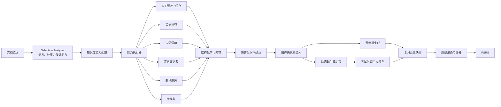
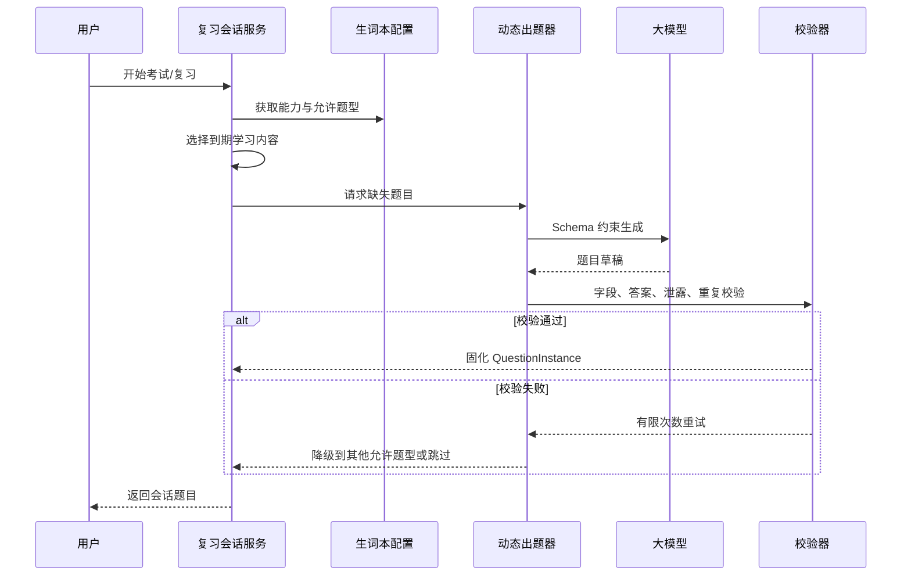

# LazyMind 文档学习能力与生词复习系统改造方案

> 状态：设计提案
> 目标读者：产品、前端、Core 后端、算法、测试
> 适用范围：知识库阅读、文档选区交互、生词本、复习与考试、词典和翻译服务接入

## 1. 方案摘要

本方案将现有以英语单词为中心的“划词—加入生词本—固定题型复习”能力，改造成可支持英语、现代汉语、文言文及后续其他学科的通用文档学习系统。

核心设计是把系统拆成四个彼此独立但可组合的层次：

1. **用户能力（Capability Family）**：对外只保留解释、翻译、赏析三类。拼音、英语词典、汉语词典、文言文词典、翻译 API 等是结果字段或内部 Provider，不再作为并列的用户能力。新增用户能力仍需要研发改代码、补充 Schema、执行逻辑、权限、i18n 和测试。
2. **内容提供器（Provider）**：英语词典、汉语词典、文言文词典、翻译服务、大模型、人工预存等负责取得原始内容。
3. **能力组合（Capability Profile）**：系统提供面向论文集、语文学习、英语学习、法律文献等场景的默认组合；用户也可以命名一个自定义组合，并从已注册能力中选择成员。生词本绑定且仅绑定一种能力，并可进一步选择该能力支持的题目类型。
4. **题目类型（Question Type）**：选择、填空、完形填空以及后续新增的题型由代码注册。新增题型需要实现生成、展示、作答、评分、序列化、i18n 和兼容测试。

知识库决定“阅读时有哪些按钮”，生词本决定“收藏什么结构的数据、用什么题型学习”。两者通过能力类别连接，但不互相替代。用户选择文档内容后，系统先识别其语言、文本粒度和候选能力，再过滤出兼容生词本；用户选定生词本后，加入界面展示该生词本能力对应的结构化 Schema。

对于无法稳定预制的题目，系统只保存可复用的学习内容与出题约束，在考试会话创建时调用大模型生成题目，并把生成结果固化为本次会话快照，确保评分、重试和复盘可追溯。

## 2. 背景与现状

### 2.1 已有能力

当前系统已经具备以下可复用基础：

- PDF 文档选区、上下文获取、翻译、提问及加入生词；
- `vocabulary_words`、例句、标签、词本及文档来源关联；
- 英语词典查询，且记录来源、版本、许可和定位信息；
- 腾讯翻译服务；
- `word_to_meaning`、`meaning_to_word`、`sentence_cloze` 三种复习卡；
- FSRS 调度、复习会话、答题记录和文档生词面板。

### 2.2 当前限制

当前领域模型将学习对象默认等同于英语单词：

- 学习内容主要依赖 `term`、`meaning`、`part_of_speech` 和 `example`；
- 添加单词时固定创建三种卡片；
- 出题、答案判断和干扰项生成直接判断固定 `card_type`；
- 词本没有能力类型，理论上可以混入互不兼容的内容；
- 英语词典和翻译服务是具体接口，尚未形成统一的内容解析链路；
- 知识库不能声明自己提供哪些学习能力；
- 用户可见的能力、Schema 字段和题型尚无统一的 i18n 元数据机制。

因此，文档选区与 FSRS 可以继续复用，但内容获取、词本边界和题目生成需要完成领域抽象。

## 3. 目标与非目标

### 3.1 建设目标

- 能力类别由代码显式注册，行为稳定、可测试、可治理；
- 知识库可以启用一个或多个能力，并配置其顺序和可用范围；
- 每个生词本绑定一种能力，禁止不同能力的数据混放；
- 加入学习内容时，先智能识别并过滤兼容生词本，再由用户确认；
- 加入表单由能力 Schema 驱动，但 Schema 本身来自代码注册，不接受任意运行时代码；
- 内容解析可以组合人工预存、缓存、英语词典、汉语词典、文言文词典、翻译服务和大模型；
- 生词本可选择自己支持的题目类型，且只能选择与其能力兼容的类型；
- 同时支持预制题和考试时动态生成题，并保证会话内题目稳定；
- 所有面向用户的名称、说明、字段、状态、错误和校验提示支持中英文 i18n；
- 尽量保留现有 FSRS、复习会话、来源关联和英语生词数据。

### 3.2 非目标

- 第一阶段不允许用户编写任意 JavaScript、SQL、正则流水线或后端插件；
- 第一阶段不允许用户创建全新的能力类别或题目类型，只允许选择和配置代码已注册的类型；
- 不把大模型答案视为教材标准答案；人工或权威词典内容优先；
- 不在每次展示卡片时重新生成题目；动态题必须在会话创建时固化；
- 不在首期实现所有主观题的自动精确评分。

## 4. 设计原则

### 4.1 类型由代码定义，组合由配置完成

能力类别和题目类型会影响后端执行、前端渲染、数据校验和评分，必须由代码注册。知识库和生词本只保存注册项的稳定 `key` 与配置，不保存可执行代码。

### 4.2 内容与题目分离

“对这段内容的解释是什么”属于学习内容；“如何考察这个解释”属于题目。一个学习内容可以生成多种题目，同一题型也可以消费不同能力的标准化字段。

### 4.3 词典提供候选事实，模型负责消歧和组织

英语、现代汉语和古汉语词典负责可追溯义项；模型可以结合上下文选择义项、补全缺失字段或生成赏析，但不能覆盖人工修订内容，也不能伪装成词典来源。

解释能力采用“当前语境优先”的组合结果：大模型只抽取所选内容在当前上下文中的含义，不负责罗列所有词典义项，也不重复生成拼音和例句；词典结果中的默认释义、读音和例句独立保留，展示时再与当前语境义拼接。现有结构化结果 Schema 无需整体迁移，仅增加可选的 `dictionary_meaning` 展示字段；旧缓存和旧客户端仍可读取原字段。

### 4.4 调度与学科无关

FSRS 仅负责决定复习时间，不理解英语、文言文或赏析。题目实例提供 prompt、答案规范和评分方式，调度器只消费评分结果。

### 4.5 兼容性必须由后端最终校验

前端过滤用于体验，后端必须再次检查“文本识别结果—能力—词本—题型”的兼容关系，避免旧客户端或并发更新写入非法数据。

## 5. 总体架构



建议新增 `backend/core/learning` 领域模块。过渡期由它调用现有 `vocabulary`、`translation` 和模型配置；稳定后再逐步把通用逻辑从 `vocabulary` 迁出。

## 6. 核心领域模型

### 6.1 能力类别 `CapabilityType`

能力类别是代码注册的稳定类型。建议首批注册：

| Key | 中文 | 典型输入 | 主要结果 | 默认 Provider |
|---|---|---|---|---|
| `english_definition` | 英语释义 | 英文词、短语 | 音标、词性、释义、例句 | 英语词典，LLM 补全 |
| `chinese_definition` | 汉语解释 | 汉字、词语、成语 | 拼音、词性、义项、例句 | 汉语词典，LLM 消歧 |
| `classical_definition` | 文言文解释 | 字、词、短语 | 古义、通假、活用、出处 | 文言文词典，LLM 消歧 |
| `general_translation` | 翻译 | 词、句、段 | 译文、源/目标语言 | 翻译服务，LLM 兜底 |
| `classical_translation` | 文言文翻译 | 文言句、段 | 译文、关键词、句式、省略 | 文言词典 + LLM |
| `pinyin` | 拼音（兼容适配器，不在新建界面单独展示） | 汉字、词、句 | 拼音、声调、多音字说明 | 汉语/文言词典 + 规则 |
| `literary_appreciation` | 赏析 | 句、段、文章 | 手法、证据、效果、主旨关系 | 预存内容 + LLM |

其中“解释”在产品界面是一级能力，工程上由 `english_definition`、`chinese_definition`、`classical_definition` 三个提供者实现。三者使用不同 Schema、Provider 和适用范围，不能仅依靠一个 `language` 参数分支。`pinyin` 只为读取已有配置和数据保留，新配置由解释能力的字段承载拼音，不再作为独立能力暴露。

建议注册接口：

```go
type CapabilityDefinition struct {
    Key                    string
    Version                int
    NameI18nKey            string
    DescriptionI18nKey     string
    SupportedLanguages     []string
    SupportedSubjectKinds  []SubjectKind
    OutputSchema           SchemaDefinition
    ResolverPipeline       string
    AllowedQuestionTypes   []string
    DefaultQuestionTypes   []string
}

type CapabilityRegistry interface {
    Register(def CapabilityDefinition, executor CapabilityExecutor) error
    Get(key string, version int) (CapabilityDefinition, bool)
    List() []CapabilityDefinition
}
```

注册校验必须保证：

- `key + version` 唯一；
- i18n key 非空；
- Schema 字段 key 唯一且为稳定机器名；
- Pipeline 已注册；
- 默认题型是允许题型的子集；
- 每种允许题型的输入要求能被能力 Schema 满足。

### 6.2 Schema 定义

能力 Schema 不是随意存储的 JSON Schema，而是代码注册的、安全的 UI Schema 子集：

```go
type SchemaField struct {
    Key             string
    Type            FieldType // string, text, string_list, enum, object_list
    LabelI18nKey    string
    HelpI18nKey     string
    Required        bool
    Editable        bool
    Searchable      bool
    MaxLength       int
    EnumOptions     []LocalizedOption
}
```

例如 `classical_definition`：

```json
{
  "surface": "走",
  "pinyin": "zǒu",
  "meaning_in_context": "跑、奔跑",
  "part_of_speech": "verb",
  "phenomena": ["ancient_modern_difference"],
  "dictionary_senses": [
    {
      "definition": "跑",
      "citation": "古汉语词典条目定位"
    }
  ],
  "explanation": "此处与现代汉语常用义不同"
}
```

数据库保存 `schema_version`。能力升级 Schema 时必须提供迁移或兼容读取逻辑，不直接修改旧版本含义。

### 6.3 知识库能力配置 `KnowledgeBaseCapability`

知识库可以选择一个或多个能力：

```text
knowledge_base_capabilities
- id
- owner_id
- dataset_id
- capability_key
- capability_version
- enabled
- display_order
- settings_json
- created_at / updated_at
UNIQUE(dataset_id, capability_key)
```

`settings_json` 只允许覆盖能力定义公开的配置，例如：

- 是否自动解析；
- 是否允许模型兜底；
- 默认目标语言；
- 最大选区长度；
- 是否显示候选义项；
- 模型结果是否需要用户确认。

#### 6.3.1 能力组合 `CapabilityProfile`

系统在单个能力之上提供面向场景的默认组合。组合只引用代码已注册的能力，不创造新的能力执行逻辑：

```text
capability_profiles
- id
- owner_id nullable          // null 表示系统内置
- profile_key                // 内置组合的稳定 key
- custom_name nullable       // 用户自定义组合名称
- description nullable
- capability_refs_json       // 能力 key、版本、默认设置和顺序
- builtin
- created_at / updated_at
```

首批组合应只组合已经注册的原子能力。下表是当前明确、可执行的范围；场景不再用近义名称暗示尚未实现的能力：

| 场景组合 | 默认能力 | 典型用途 |
|---|---|---|
| 通用阅读 | 解释、翻译 | 产品资料、内部文档和中英文混合材料 |
| 论文集 | 解释、翻译 | 中英文论文阅读和专业术语学习；不承诺方法论解析 |
| 现代语文学习 | 解释、赏析 | 现代文词义、读音和文学表达学习；拼音由解释结果提供 |
| 语文学习·文言文 | 解释、翻译、赏析 | 古文实词、句式、翻译和鉴赏；内部自动选择文言 Provider |
| 英语学习 | 解释、翻译 | 英文阅读、词汇积累和复习；音标属于解释结果字段 |
| 法律文献 | 解释、翻译 | 法条、合同、判例中的术语和涉外文本；不承诺条款要件分析 |
| 技术文档 | 解释、翻译 | API、架构和工程资料中的术语与跨语言阅读；不承诺代码/公式解析 |
| 历史资料 | 解释、翻译 | 现代材料与古代史料混合阅读；不承诺人物知识卡或时间线 |
| 自定义 | 用户选择任意已注册能力组合 | 组织或个人的特殊学习场景 |

表中的“术语解释”“段落解析”“法律术语解释”“条款释义”“要件分析”“代码/公式说明”等能力只有在相应 `CapabilityType` 已由代码实现并注册后才能被选择。未实现时，内置组合应隐藏这些能力或标记为不可用，不能仅靠 prompt 假装系统已经支持。

#### 6.3.1.1 当前用户能力责任边界

| 用户能力 | 输入边界 | 输出责任 | 内部路由 |
|---|---|---|---|
| 解释 | 字、词、短语、句子或段落 | 对“选多少就解释多少”；短选区给出当前语境词义，长选区解释整体意思。可附词典默认释义、拼音/音标和例句 | 按文字、语言、场景及上下文选择 `chinese_definition`、`english_definition` 或 `classical_definition`；`pinyin` 仅作为旧版兼容适配器 |
| 翻译 | 词、短语、句子或段落 | 忠实翻译所选整体，不承担词典义项枚举或文学评价 | 按场景选择 `general_translation` 或 `classical_translation` |
| 赏析 | 具有表达分析价值的句段或全文 | 表达手法、原文证据和表达效果 | 使用 `literary_appreciation` |

旧能力 key 继续保留在存储、缓存、词本与 Provider 调度层，作为前向兼容的内部适配器；普通用户界面只出现上述三类。开发者模式可以查看内部适配器及其 Provider、缓存范围和 Schema 配置。

“输入语言”和“回答语言”是两个独立维度。释义类能力的 `output_language` 支持：`auto`（跟随原文）、`zh-Hans`、`en`、`zh-Hans+en`。中英双语使用同一 Schema，文本字段按“中文在前、英文在后”生成，因此不新增能力 key，也不破坏既有内容和 API。更改回答语言会形成独立缓存身份，避免中文缓存误命中双语请求。

“自定义类别名称”在领域模型中是 `CapabilityProfile.custom_name`，例如“专利英文精读”或“初中文言文”。它是一个用户命名的能力组合，而不是新的 `CapabilityType`。用户可以：

- 填写组合名称和说明；
- 选择一个或多个已注册能力；
- 调整能力显示顺序；
- 修改每个能力允许开放的配置；
- 保存为个人组合，供后续知识库复用。

用户不能通过自定义组合增加新的 Schema、执行器或题型。如果需要新的能力类别，仍需经过代码注册、i18n、接口、渲染和测试流程。

#### 6.3.2 知识库引用组合

知识库创建时可以选择一个内置或个人组合，系统将组合内容复制为知识库级配置快照。后续修改组合模板不应静默改变既有知识库；用户可以主动执行“同步组合更新”并预览差异。

知识库也可以在选定组合后增删能力，形成该知识库自己的组合。数据库中的 `knowledge_base_capabilities` 仍是最终运行事实，`profile_id/profile_version` 只用于记录来源和升级提示。

创建知识库和知识库设置页都可以编辑组合。删除某能力时不删除历史学习内容，只停止新入口并标记配置停用。

### 6.4 学习集（词汇场景显示为“生词本”）`LearningBook`

现有 `Wordbook` 在领域层升级为 `LearningBook`，产品层根据能力显示为“生词本”“翻译练习集”“赏析集”等名称。每个学习集只允许绑定一种能力：

```text
learning_books
- id
- owner_id
- name
- description
- capability_key
- capability_version
- enabled_question_types_json
- generation_policy_json
- archived_at
- created_at / updated_at
UNIQUE(owner_id, name)
```

关键约束：

- `capability_key` 创建后不可直接修改；需要转换时通过“复制并转换到新词本”；
- 同一词本不能同时放 `english_definition` 和 `classical_definition`；
- 两个相同能力的词本可以拥有不同题型组合；
- `enabled_question_types` 必须是能力允许题型的子集；
- 已存在卡片的题型被关闭后停止产生新卡，但历史记录保留；
- 删除词本沿用移动或删除内容的语义，但只能移动到相同能力和兼容 Schema 版本的词本。

示例：

```text
英语技术词汇
  capability = english_definition
  questions = [single_choice, text_input, cloze]

《木兰诗》重点实词
  capability = classical_definition
  questions = [single_choice, text_input, context_judgment]

古文句子翻译
  capability = classical_translation
  questions = [translation_response, rubric_self_assessment]
```

### 6.5 学习对象、出现位置与内容

建议通用化为三层：

```text
learning_subjects
- id, owner_id
- subject_kind              // character, word, idiom, sentence, passage...
- normalized_text
- display_text
- language
- created_at / updated_at

learning_occurrences
- id, owner_id, subject_id
- dataset_id, document_id, segment_id
- page, bbox_json
- selected_text, context_text
- start_offset, end_offset
- document_revision
- created_at

learning_contents
- id, owner_id
- subject_id, occurrence_id nullable
- capability_key, capability_version, schema_version
- content_json
- origin                    // user, teacher, import, dictionary, translation, llm
- status                    // draft, published, stale, failed
- provider_trace_id nullable
- model_config_id nullable
- generator_version
- user_edited
- created_at / updated_at
```

同一个字在不同语境下可以共享 `learning_subject`，但保留不同 `occurrence` 和 `learning_content`。文言实词必须优先使用 occurrence 级语境义，不能被全局释义覆盖。

### 6.6 词本条目

```text
learning_book_entries
- id
- owner_id
- book_id
- content_id
- status
- created_at
UNIQUE(book_id, content_id)
```

加入时存最终 `content_id`，而不是只存文本。这样题目始终能读取当时确认的能力和 Schema；内容修订则通过版本或明确更新卡片完成。

## 7. 内容提供器与词典设计

### 7.1 统一 Provider 接口

```go
type ResolveRequest struct {
    CapabilityKey   string
    SelectedText    string
    ContextText     string
    Language        string
    SubjectKind     SubjectKind
    DatasetID       string
    DocumentID      string
    DocumentRevision string
    OutputSchema    SchemaDefinition
}

type ResolveResult struct {
    Status       ResolveStatus
    Content      map[string]any
    Candidates   []ProviderCandidate
    Evidence     []EvidenceRef
    MissingFields []string
    CacheControl CacheControl
}

type ContentProvider interface {
    Key() string
    Capabilities() ProviderCapabilities
    Resolve(context.Context, ResolveRequest) (ResolveResult, error)
}
```

首批 Provider：

- `PresetProvider`：用户、教师、知识库管理员预存；
- `CacheProvider`：读取已发布或仍有效的生成内容；
- `EnglishDictionaryProvider`：复用现有英语词典；
- `ChineseDictionaryProvider`：新增现代汉语词典；
- `ClassicalChineseDictionaryProvider`：新增文言文词典；
- `TranslationProvider`：封装现有腾讯翻译，未来可增加其他厂商；
- `LLMProvider`：结构化生成、消歧、补全和动态出题；
- `CompositeProvider`：编排和合并以上来源。

### 7.2 汉语词典 `ChineseDictionaryProvider`

面向现代汉语的汉字、词语和成语，建议统一标准化输出：

```json
{
  "headword": "踌躇",
  "traditional": "躊躇",
  "pinyin": "chóu chú",
  "part_of_speech": ["verb"],
  "senses": [
    {
      "definition": "犹豫不决",
      "examples": [],
      "labels": []
    }
  ],
  "idiom_metadata": null
}
```

能力要求：

- 支持简繁归一、全角和 Unicode 规范化；
- 支持单字、多字词、成语；
- 支持多音字和多个词性；
- 精确词条优先，允许前缀树做选区内最长命中；
- 不直接把所有义项写成当前语境义；需要根据上下文让用户选择或由模型消歧；
- 保存词典名称、版本、许可、原始条目 ID 和定位信息。

首期词典数据源必须在实施前完成授权审查。本方案不预设具体商业或开源数据源，以免把许可不明确的数据纳入产品。

### 7.3 文言文词典 `ClassicalChineseDictionaryProvider`

文言文词典与现代汉语词典分开注册、分开索引，标准化输出至少包括：

```json
{
  "headword": "走",
  "readings": ["zǒu"],
  "senses": [
    {
      "definition": "跑、奔跑",
      "period": "古代汉语",
      "part_of_speech": "verb",
      "citations": [
        {
          "text": "双兔傍地走",
          "source": "《木兰诗》"
        }
      ]
    }
  ],
  "phenomena": [
    {
      "type": "ancient_modern_difference",
      "description": "古义偏向奔跑"
    }
  ],
  "variants": [],
  "loan_characters": []
}
```

除普通义项外，需要表达：

- 古今异义；
- 通假字；
- 词类活用；
- 一词多义；
- 特殊读音；
- 时代或文体标签；
- 例句及出处。

文言词的最终解释流程默认是“词典给候选义项，模型结合当前句子消歧，用户可修订”。如果没有可靠词典命中，可以由模型生成，但来源必须显示为“AI 生成”，不得显示为词典释义。

### 7.4 词典存储与索引

现有 `vocabulary_dictionary_entries/senses/examples/imports` 可以保留给英语兼容路径。通用方案建议新建 `learning_dictionary_*` 表，避免强行把古汉语现象塞入英语 Schema：

```text
learning_dictionary_imports
- id, provider_key, source_name, source_version
- license_id, source_url, checksum, imported_at

learning_dictionary_entries
- id, provider_key, language
- normalized_headword, display_headword
- payload_json
- priority
- source_name, source_version, license_id, source_locator

INDEX(provider_key, language, normalized_headword, priority)
```

数据量增大后，可为中文和文言词典构建内存前缀树或本地只读索引；数据库保存元数据及可追溯信息。索引版本必须与导入版本绑定，可原子切换并支持回滚。

### 7.5 能力解析流水线

每个能力在代码中绑定一条允许配置参数的流水线，不能由普通用户任意编排 Provider。

典型流水线：

```text
english_definition:
  preset -> cache -> EnglishDictionary -> LLM(fill_missing/disambiguate)

chinese_definition:
  preset -> cache -> ChineseDictionary -> LLM(disambiguate/fill_missing)

classical_definition:
  preset -> cache -> ClassicalChineseDictionary -> LLM(disambiguate/fill_missing)

general_translation:
  preset -> cache -> TranslationProvider -> LLM(fallback)

classical_translation:
  preset -> cache -> ClassicalChineseDictionary(context evidence)
  -> LLM(structured translation)

literary_appreciation:
  preset -> cache -> LLM(structured generation)
```

能力执行器负责字段合并策略：

- `return_if_complete`：权威预存内容完整时立即返回；
- `merge_candidates`：保留多个词典义项；
- `disambiguate`：结合 occurrence 选择当前义；
- `fill_missing`：模型只补缺失字段；
- `fallback`：外部服务失败后使用模型；
- `generate`：模型是该能力的主要来源。

### 7.6 分层预置内容与 KV 模型

每个能力可以在三个层级预置键值内容：

1. **能力级**：对当前用户空间内所有知识库生效，例如固定术语译法；
2. **知识库级**：对某个知识库生效，例如论文集中统一的缩略词和人名译法；
3. **文章级**：只对一篇文档及其 revision 生效，例如本文中“走”的古义或某段赏析。

```text
learning_presets
- id, owner_id
- scope_type                 // capability, knowledge_base, document
- scope_id                   // capability key、dataset id 或 document id
- document_revision nullable
- capability_key, capability_version
- normalized_key
- value_json
- schema_version
- origin                     // user, teacher, import, llm_preanalysis
- priority
- user_edited
- created_at / updated_at
UNIQUE(owner_id, scope_type, scope_id, capability_key, normalized_key, schema_version)
```

`normalized_key` 不一定只是选中文字。不同能力可以提供自己的 key builder：

```text
翻译：source_language + target_language + normalized_text
英语释义：language + lemma
汉语解释：normalized_headword
文言文解释：normalized_headword + context_signature（文章级）
赏析：document_revision + start_offset + end_offset + context_hash
```

查找优先级默认是“文章级 > 知识库级 > 能力级”。命中高层级内容后仍可保留下层来源作为候选或证据。人工编辑内容优先于模型预分析内容；模型不得覆盖 `user_edited=true` 的值。

预置入口包括：

- 用户在能力设置、知识库设置或文章学习面板手工新增/批量导入 KV；
- 教师或知识库管理员发布标准内容；
- 导入词典或结构化材料；
- 用户启动“大模型预分析”，后台扫描指定文章，按选定能力 Schema 生成候选 KV；
- 文档导入完成后，按知识库策略自动预分析。

大模型预分析结果先进入 `draft`，默认不覆盖已发布内容。能力可以声明是否允许自动发布；赏析、法律要件分析等高解释性内容建议默认需要确认。

预分析任务需要记录文档 revision、能力和 prompt 版本，支持进度、取消、失败重试、部分成功、差异预览和重新生成。文章更新后，对应结果标记为 `stale`。

### 7.7 缓存作用域、版本与并发

每个能力在代码注册时声明默认缓存作用域和允许用户选择的范围：

```go
type CachePolicy struct {
    DefaultScope CacheScope   // user_global, knowledge_base, document
    AllowedScopes []CacheScope
    ContextSensitive bool
    TTL time.Duration         // 0 表示按版本失效
}
```

建议默认值：

| 能力 | 默认缓存作用域 | 原因 |
|---|---|---|
| 英语释义 | 用户全局 | lemma 的基础释义可跨文档复用，语境义另存文章覆盖 |
| 汉语解释 | 用户全局 | 常规词义可复用，多音/语境义允许文章覆盖 |
| 文言文解释 | 文章级 | 古义高度依赖作品和句子语境 |
| 普通翻译 | 用户全局 | 相同语言对与规范文本默认复用；知识库可覆盖术语译法 |
| 文言文翻译 | 文章级 | 依赖上下文、省略、人物和篇章语义 |
| 拼音 | 用户全局 | 基础读音稳定；多音字结果可文章覆盖 |
| 赏析 | 文章级 | 依赖全文、段落位置和上下文 |

这里的“用户全局”仅指当前 owner 的私有空间，不默认跨用户共享。将某项内容发布为公共缓存需要独立的审核、许可和租户隔离机制。

能力默认行为可以在知识库配置中覆盖，但必须受 `AllowedScopes` 限制。例如赏析原则上不允许改为忽略上下文的纯文本全局缓存；普通翻译允许改成知识库级，以便执行统一术语表。

缓存键至少包含：

```text
owner/dataset scope
document_id + document_revision
selected_text + start_offset + end_offset
context_hash
capability_key + capability_version + schema_version
provider/pipeline version
model + prompt version
locale/target language
```

对于用户全局缓存，文档 ID、offset 和 revision 不进入主 key；如果能力标记为 `ContextSensitive`，则即便默认全局，也应将“通用结果”和“文章语境覆盖”分层保存。普通翻译默认全局复用相同语言对和文本，但用户请求“结合上下文翻译”时必须写入知识库级或文章级覆盖。

同一缓存键使用 singleflight 或幂等任务，避免重复调用外部服务。能力、词典、prompt 或文档升级后，旧结果标记为 `stale`，不删除人工编辑版本。

## 8. 知识库能力组合与阅读交互

### 8.1 创建与设置

知识库创建弹窗增加“学习能力”区域：

1. 选择场景组合：通用知识库、论文集、现代文学习、文言文学习、英语学习、法律文献、技术文档、历史资料或自定义；
2. 展示模板包含的能力；
3. 自定义模式填写组合名称，并从注册表返回的能力中多选；
4. 每种能力仅展示允许修改的设置；
5. 创建后可在知识库设置页修改。

知识库详情接口返回已启用能力及本地化前所需的 i18n key。前端按 `display_order` 渲染选区按钮，不在组件内硬编码“解释”“翻译”“赏析”。

### 8.2 Selection Analyzer

用户划选后，先做低成本识别：

```json
{
  "language": "zh-Hans",
  "subject_kind_candidates": ["word", "classical_word"],
  "script_features": {
    "contains_han": true,
    "contains_latin": false
  },
  "length": 2,
  "knowledge_base_capabilities": [
    "classical_definition",
    "classical_translation"
  ]
}
```

静态规则先排除明显不可能的组合；对“中文现代词还是文言词”这类依赖语境的情况，使用知识库模板、词典命中和轻量模型分类综合判断，并保留置信度。

能力按钮过滤规则：

```text
知识库已启用
AND 语言兼容
AND 文本粒度兼容
AND 长度在限制内
AND 所需 Provider 可用或存在允许的 fallback
```

### 8.3 选区命中

默认顺序：

1. 同文档 revision、相同 offset 的 occurrence；
2. 同文档相同文本并通过上下文消歧；
3. 选区内最长词典或预存条目命中；
4. 包含所选单字的当前语境词条；
5. 全库或全局规范词条；
6. 未命中时按能力流水线生成。

长选区采用“整体动作结果 + 内部已识别知识点”双层展示。单字属于多个候选词时不静默决定，展示按位置、长度、上下文、人工优先级排序的候选。

## 9. 加入生词本流程

### 9.0 产品命名决策：保留“生词本”，新增上位概念“学习集”

建议不要把所有入口一刀切改名为“学习本”。“生词本”已经准确表达英语单词、现代汉语词语、文言实词和成语的收藏与复习，也有较低的理解成本；但翻译句、段落赏析、法律条款或论文方法并不是“生词”。

推荐采用两层命名：

- **学习集**：通用领域名称和一级产品入口，可承载词、句、段、概念及赏析；
- **生词本**：`subject_kind` 仅为字符、词、短语、成语时的界面别名；
- **句子集 / 翻译练习集 / 赏析集**：由能力注册项提供更贴切的 `collectionNameI18nKey`；
- 后端统一使用 `learning_books`，不再把通用 API 命名为 vocabulary wordbook。

迁移期间导航可以显示“学习集（原生词本）”，英语和词汇场景内继续显示“生词本”。旧 API、路由和数据库表名通过兼容层保留一段时间，不要求一次性重命名。这样既避免用户认知突变，也不会让“把一段赏析加入生词本”成为长期产品语义。

### 9.1 先选能力，再过滤词本

如果用户从某个能力结果点击“加入生词本”，能力已经确定；如果直接点击“加入学习”，先根据 Selection Analyzer 和知识库能力给出候选能力。

过滤过程：

```text
候选词本 = 用户可写的未归档词本
  WHERE book.capability_key == selected_capability
  AND capability 支持识别到的语言
  AND capability 支持 subject_kind
  AND book.schema_version 可接受当前内容
```

因此：

- 英文单词不会出现文言文解释词本；
- 文言句子不会出现仅接收英语单词释义的词本；
- “赏析”内容不会放进“文言实词解释”词本；
- 一个内容要同时学习解释和翻译时，形成两个 `learning_content`，分别加入对应能力的两个词本。

前端过滤不是安全边界。提交时后端重新校验，并在失败时返回稳定错误码，例如：

- `LEARNING_BOOK_CAPABILITY_MISMATCH`
- `LEARNING_SUBJECT_KIND_UNSUPPORTED`
- `LEARNING_CONTENT_SCHEMA_INCOMPATIBLE`
- `LEARNING_PROVIDER_UNAVAILABLE`

### 9.2 没有兼容词本

界面显示“新建适用生词本”，默认带入当前能力和推荐题型。创建后自动返回加入流程，但仍需用户确认内容。

### 9.3 根据词本能力显示 Schema

用户选定词本后，表单读取该词本绑定能力的 Schema：

- 必填字段展示校验状态；
- 自动取得的词典或模型内容带来源标识；
- 可编辑字段允许用户修订；
- 只读证据字段展示来源与版本；
- 缺少必填字段时提供“自动补全”或人工填写；
- 切换到另一个相同能力词本时保留内容；
- 能力不同的词本不会出现在选项中，因此不存在跨 Schema 强行切换。

不要直接用 JSON Schema 自动生成所有控件。注册定义中应允许能力提供自定义前端编辑器；未提供时才使用通用 Schema Form。

### 9.4 一次加入多个词本

允许一次选择多个词本，但必须全部属于相同能力且 Schema 兼容。提交使用一个事务写入共享 `learning_content` 和多个 `learning_book_entries`。

## 10. 题目类型与卡片生成

### 10.1 题目类型由代码注册

首批保留并规范化：

| Key | 产品名称 | 交互 | 评分方式 | 是否可动态生成 |
|---|---|---|---|---|
| `single_choice` | 选择题 | 单选选项 | 精确匹配 | 是 |
| `text_input` | 填空题 | 单个或短文本输入 | 规范化匹配或自评 | 是 |
| `cloze` | 完形填空 | 文中空缺输入 | 规范化匹配 | 是 |

建议下一阶段增加：

| Key | 产品名称 | 典型场景 |
|---|---|---|
| `multiple_choice` | 多选题 | 多个修辞、多个词义特征 |
| `true_false` | 判断题 | 成语使用、释义正误 |
| `ordering` | 排序题 | 句子排序、事件顺序 |
| `matching` | 匹配题 | 词语与义项、作者与作品 |
| `translation_response` | 翻译题 | 文言句翻译 |
| `short_answer` | 简答题 | 句子作用、主旨概括 |
| `rubric_self_assessment` | 要点自评题 | 赏析、开放翻译 |

新增题型必须改代码，至少包括：

- 后端题型注册和 payload Schema；
- 静态/动态生成器；
- 答案规范与评分器；
- 会话快照序列化；
- 前端题目渲染器和答题组件；
- 复盘展示；
- 无障碍和键盘交互；
- 中英文 i18n；
- OpenAPI 类型和兼容测试。

建议接口：

```go
type QuestionTypeDefinition struct {
    Key                 string
    Version             int
    NameI18nKey         string
    DescriptionI18nKey  string
    PayloadSchema       SchemaDefinition
    SupportedGraders    []string
}

type QuestionGenerator interface {
    Generate(context.Context, GenerationRequest) (QuestionDraft, error)
}

type QuestionGrader interface {
    Grade(context.Context, QuestionInstance, UserAnswer) (GradeResult, error)
}
```

前端维护显式 renderer registry：

```ts
const questionRenderers: Record<QuestionTypeKey, QuestionRenderer> = {
  single_choice: SingleChoiceQuestion,
  text_input: TextInputQuestion,
  cloze: ClozeQuestion,
};
```

遇到客户端不认识的新题型时必须显示“当前版本暂不支持此题型”，不能白屏，也不能把答案泄露为普通 JSON。

### 10.2 能力与题型兼容矩阵

能力注册表声明允许题型，生词本从中选择子集：

| 能力 | 默认题型 | 可选扩展题型 |
|---|---|---|
| 英语释义 | 选择、填空、完形填空 | 判断、匹配 |
| 汉语解释 | 选择、填空、完形填空 | 判断、匹配 |
| 文言文解释 | 选择、填空 | 判断、匹配、简答 |
| 普通翻译 | 填空 | 翻译题、要点自评 |
| 文言文翻译 | 要点自评 | 翻译题、填空、简答 |
| 拼音 | 填空、选择 | 匹配 |
| 赏析 | 要点自评 | 选择、多选、简答 |

MVP 如果尚未实现新题型，相关能力只允许选择现有三种中语义合理的类型。例如赏析在 MVP 可以只启用动态生成的 `single_choice`；待 `rubric_self_assessment` 实现后再开放主观题。

### 10.3 卡片配方 `CardRecipe`

题目类型只定义交互协议；卡片配方定义“如何用某能力的字段生成该题”：

```json
{
  "key": "classical_context_meaning_choice",
  "capability_key": "classical_definition",
  "question_type": "single_choice",
  "required_fields": ["meaning_in_context"],
  "generation_mode": "prebuilt",
  "prompt_template_key": "learning.recipe.classicalContextMeaning.prompt",
  "distractor_strategy": "same_capability_other_senses",
  "grader": "exact_choice"
}
```

模板正文如果直接参与出题，也应按 locale 管理，但稳定答案字段不能依赖界面语言变化。

### 10.4 预制题与动态题

`generation_mode` 支持：

- `prebuilt`：加入词本时即可由确定字段生成；
- `dynamic`：创建考试/复习会话时必须调用大模型；
- `hybrid`：优先使用已缓存题，数量不足时动态补充。

适合预制：

- 词义选择；
- 拼音填空；
- 有现成例句的完形填空；
- 确定答案的词义回忆。

通常需要动态生成：

- 赏析选择题的题干和干扰项；
- 新语境中的成语使用判断；
- 综合多个文言知识点的题目；
- 用户要求“每次换一道语境题”的场景。

### 10.5 动态题生成流程



必须遵守：

- 动态生成发生在会话准备阶段，不发生在每次 React render；
- 题干、选项、答案规范、解释、模型与 prompt 版本保存为 `QuestionInstance`；
- 同一会话刷新后返回相同题目；
- 只有所有客观题字段校验通过后才可进入会话；
- 动态题生成失败时按照词本配置降级：使用缓存题、换允许题型、减少题数，最终明确告知；
- 不因为某一道题失败而重复写入 FSRS 复习结果；
- 动态生成应有批量接口、超时、并发上限和成本审计。

### 10.6 题目数据模型

```text
learning_cards
- id, owner_id, book_entry_id
- recipe_key, recipe_version
- question_type, question_type_version
- generation_mode
- scheduler_state_json
- row_version, suspended_at
- created_at / updated_at

learning_question_instances
- id, owner_id, card_id, session_id
- payload_json             // 题干、选项、空位等
- answer_spec_json
- explanation_json
- locale
- generator_type           // deterministic, llm
- generator_version
- model_config_id nullable
- content_version
- status
- created_at

learning_answers
- id, owner_id, session_id, question_instance_id
- response_json
- grade_json
- answered_at
- idempotency_key
```

现有复习会话把 prompt 和 expected answer 固化的做法可以保留并扩展，但不能继续只保存 `term/meaning`。

### 10.7 评分策略

- 选择题：答案 ID 精确匹配；
- 填空与完形填空：Unicode 规范化、可配置大小写/标点/空白容忍、允许答案列表；
- 翻译和简答：MVP 采用参考答案、评分要点和用户自评；
- 后续 LLM rubric 评分必须展示评分依据，并允许用户纠正；
- FSRS 接收统一的 `again/hard/good/easy`，题型评分先转换为这一层，不让 FSRS 感知题型。

## 11. API 设计

以下为建议资源和语义，最终命名应同步更新 Core OpenAPI。

### 11.1 注册表与知识库配置

```http
GET  /api/core/learning/capabilities
GET  /api/core/learning/question-types

GET  /api/core/datasets/{dataset_id}/learning-capabilities
PUT  /api/core/datasets/{dataset_id}/learning-capabilities
```

注册表接口返回机器 key、版本、i18n key、兼容范围及 UI Schema。服务端返回 key 而非已经翻译的中文字符串。

### 11.2 选区识别与解析

```http
POST /api/core/learning/selections:analyze
POST /api/core/learning/content:resolve
```

`selections:analyze` 返回候选能力和兼容词本；`content:resolve` 执行指定能力的流水线。两者分离以避免用户仅打开菜单就触发高成本模型调用。

### 11.3 分层预置与预分析

```http
GET    /api/core/learning/presets?scope_type=&scope_id=&capability_key=
POST   /api/core/learning/presets
PATCH  /api/core/learning/presets/{preset_id}
DELETE /api/core/learning/presets/{preset_id}
POST   /api/core/documents/{document_id}/learning:preanalyze
GET    /api/core/learning/preanalysis-tasks/{task_id}
POST   /api/core/learning/preanalysis-tasks/{task_id}:cancel
POST   /api/core/learning/preanalysis-tasks/{task_id}:publish
```

预分析请求必须显式列出能力，不默认对知识库全部能力执行。`publish` 支持选中部分结果，并在写入前再次执行 Schema、revision 和人工编辑保护校验。

### 11.4 学习集

```http
GET    /api/core/learning/books
POST   /api/core/learning/books
PATCH  /api/core/learning/books/{book_id}
DELETE /api/core/learning/books/{book_id}
POST   /api/core/learning/books/{book_id}/entries
```

创建和更新词本时，服务端校验能力版本与题型集合。

### 11.5 会话与答题

```http
POST /api/core/learning/review/sessions
GET  /api/core/learning/review/sessions/{id}
POST /api/core/learning/review/sessions/{id}/answers
POST /api/core/learning/review/sessions/{id}:complete
```

创建接口可以先返回 `preparing`，前端通过任务状态或 SSE 获得动态出题结果。不得复用通用 `ask_user` 承载这些题，以保持现有专用复习会话语义。

### 11.6 错误契约

所有可预期业务失败使用稳定错误码，由前端映射 i18n：

- Provider 未配置或暂不可用；
- 能力与词本不兼容；
- Schema 版本不兼容；
- 动态出题超时或无有效题；
- 题型不受当前客户端支持；
- 文档 revision 变化导致内容过期；
- 词典无匹配或存在多个候选。

错误正文可以携带结构化参数，例如 `{provider: "classical_dictionary"}`，但不能把后端英文错误字符串直接展示给用户。

## 12. 前端改造

### 12.1 注册式组件边界

建议建立三个前端注册表：

1. `capabilityResultRenderers`：渲染解释、翻译、赏析结果；
2. `capabilityEditors`：编辑能力 Schema；
3. `questionRenderers`：渲染题型及提交结构化答案。

新增能力通常需要新增或确认结果渲染器；新增题型必须新增答题渲染器。通用 Schema renderer 只作为简单能力的默认实现。

### 12.2 页面变化

- 知识库创建弹窗：增加学习模板和能力组合；
- 知识库设置：允许启停、排序和配置能力；
- 文档选区浮层：按知识库能力动态显示按钮；
- 结果面板：统一展示来源、缓存状态、模型标识和编辑入口；
- 加入生词弹窗：能力确认、兼容词本过滤、Schema 表单和来源展示；
- 生词本创建/设置：必须选择能力，再选择兼容题型；
- 生词表：列和详情按能力 Schema 展示；
- 复习页：按 `question_type` 从 renderer registry 加载组件；
- 复盘页：显示当时的题目实例、答案、解释和来源版本。

## 13. i18n 设计

### 13.1 基本原则

- 数据库存机器 key，不存“解释”“赏析”等展示文案；
- 能力、题型、Schema 字段、枚举值、来源、状态和错误均使用 i18n key；
- 至少同步维护 `zh-CN` 和 `en-US`；
- 后端不拼接面向用户的自然语言提示；
- 模型生成内容的语言是内容属性，与 UI locale 分开；
- 动态题实例保存生成 locale，复盘时不得因切换 UI 语言改变原题。

### 13.2 Key 命名建议

```text
learning.capability.englishDefinition.name
learning.capability.englishDefinition.description
learning.capability.classicalTranslation.name
learning.profile.academicPapers.name
learning.profile.chineseClassical.name

learning.schema.classicalDefinition.meaningInContext.label
learning.schema.classicalDefinition.phenomena.label

learning.collection.generic.name
learning.collection.vocabulary.name
learning.collection.appreciation.name

learning.questionType.singleChoice.name
learning.questionType.cloze.description

learning.provider.chineseDictionary.name
learning.provider.classicalChineseDictionary.name

learning.error.bookCapabilityMismatch
learning.error.dynamicQuestionGenerationFailed
```

枚举值也必须本地化，例如 `part_of_speech=verb`、`phenomena=loan_character`，不得把数据库值直接展示。

### 13.3 i18n 测试

- zh-CN 与 en-US key 集合一致；
- 注册表中的所有 `NameI18nKey/LabelI18nKey` 在两种语言中存在；
- 不允许能力、题型和错误的可见中文硬编码进入组件；
- 长英文文案下按钮、选择器和 Schema 表单不截断关键内容；
- 题目内容语言和 UI 语言切换分别测试。

## 14. 权限、安全与质量控制

- 知识库能力配置继承知识库管理权限；普通读者不能修改；
- 私人词本和内容按 owner 隔离；共享知识库的教师内容与个人修订分层保存；
- Provider 凭证继续通过模型/服务配置存储，不写入能力配置；
- 模型输入需限制选区和上下文长度，避免整篇文档无界发送；
- 内容和题目生成保留 provider、模型、prompt、词典版本和来源；
- 用户编辑内容优先，后台重新生成不得覆盖；
- 词典导入必须校验 checksum、版本和许可；
- 客观题进入会话前检查正确答案存在、选项唯一、答案未泄露在题干中；
- 模型失败日志不得保存敏感凭证或完整私有文档。

## 15. 兼容与迁移方案

### 15.1 迁移映射

现有数据按以下方式兼容：

```text
现有默认/英语词本
  -> learning_book(capability = english_definition)

vocabulary_words
  -> learning_subject + english_definition learning_content

vocabulary_source_refs
  -> learning_occurrences

word_to_meaning
  -> recipe english_word_to_meaning + single_choice/text_input

meaning_to_word
  -> recipe english_meaning_to_word + text_input/single_choice

sentence_cloze
  -> recipe english_sentence_cloze + cloze
```

### 15.2 双轨演进

建议先采用双轨而非一次性替换：

1. 新的中文、文言文和赏析能力只走 `learning` 新路径；
2. 现有英语生词继续使用 `vocabulary` API，新增适配层向新 UI 暴露统一模型；
3. 新路径稳定后迁移英语数据和复习入口；
4. 迁移完成后再废弃旧 API 和旧字段。

迁移脚本必须幂等，提供迁移统计、失败记录和只读回滚路径。旧客户端访问新能力时应看不到不支持的入口，而不是读取到无法渲染的数据。

## 16. 分阶段实施计划

### 阶段 0：契约与注册表

交付物：

- 能力、Provider、题型和卡片配方注册接口；
- Schema 定义和版本规则；
- OpenAPI 草案和稳定错误码；
- zh-CN/en-US i18n key 规范；
- 兼容矩阵单元测试。

此阶段不改变用户行为。

### 阶段 1：知识库能力与三类词典

交付物：

- 论文集、语文学习、英语学习、法律文献等内置场景组合，以及可命名的自定义组合；
- 知识库模板和多能力配置；
- 动态选区按钮；
- 英语词典适配器；
- 汉语词典 Provider、导入器、索引和来源展示；
- 文言文词典 Provider、导入器、索引和上下文候选；
- 翻译 Provider 适配器；
- `classical_definition`、`chinese_definition` 和 `classical_translation` 内容解析。
- 能力级、知识库级和文章级 KV 预置，以及文章大模型预分析任务；
- 能力默认缓存作用域和知识库级覆盖。

### 阶段 2：能力隔离的生词本

交付物：

- 词本绑定单一能力；
- 加入时 Selection Analyzer 和兼容词本过滤；
- Schema 驱动的加入表单；
- 无兼容词本时快捷创建；
- 数据来源、模型标记和用户修订；
- 现有英语词本兼容适配。

### 阶段 3：通用题目框架

交付物：

- 将选择、填空、完形填空注册化；
- 题目 renderer、generator、grader registry；
- 词本题型配置；
- 通用 QuestionInstance 和会话快照；
- FSRS 通用卡片适配；
- 英语旧题型回归。

### 阶段 4：动态出题与新题型

交付物：

- 动态题生成任务、校验、重试、降级和成本记录；
- 判断、多选、翻译、简答、要点自评等优先题型；
- 文言文和赏析题目配方；
- 复盘中的生成来源与评分依据；
- 动态题质量评测集。

### 阶段 5：迁移与收敛

交付物：

- 英语词本迁移工具；
- 双轨数据一致性检查；
- 新旧 API 使用量监控；
- 旧 vocabulary 通用职责下线，保留必要兼容层。

## 17. 测试方案

### 17.1 后端单元测试

- 注册重复能力、未知题型、非法 Schema 时拒绝启动；
- 能力允许题型和词本题型子集校验；
- 英文选区不能加入文言文词本；
- 同一内容不能跨能力写入同一本；
- 汉语词典简繁、拼音、多义项和成语查询；
- 文言词典通假、活用、一词多义和出处解析；
- 上下文消歧不得覆盖词典原始证据；
- 缓存 key 包含 revision、能力和生成器版本；
- 动态题校验失败后的重试与降级；
- 答题幂等和 FSRS 更新只发生一次。

### 17.2 前端测试

- 知识库不同能力组合对应正确按钮；
- 内置组合可创建知识库，自定义组合名称和能力顺序可保存复用；
- 能力/知识库/文章三级 KV 的覆盖顺序与权限正确；
- 翻译默认命中用户全局缓存，赏析默认命中文章级缓存；
- 加入弹窗只显示兼容词本；
- 切换词本后 Schema 表单保持或重置规则正确；
- 三种现有题型由 registry 正常渲染；
- 未知题型显示兼容提示；
- 动态会话 `preparing/ready/failed` 状态；
- zh-CN/en-US 文案完整且无硬编码；
- Provider 未配置、词典无结果和模型失败的降级提示。

### 17.3 集成与端到端场景

1. 英文单词 → 英语词典 → 英语词本 → 选择/完形填空；
2. 现代汉语词语 → 汉语词典 → 汉语解释词本 → 拼音/释义题；
3. 文言实词 → 文言词典候选 → 上下文消歧 → 文言实词词本；
4. 文言句 → 关键词典证据 + LLM 翻译 → 文言翻译词本；
5. 现代文句段 → LLM 赏析 → 赏析词本 → 考试时动态选择题；
6. Provider 不可用 → 缓存或 LLM 降级；
7. 文档 revision 变化 → 旧内容标记 stale，人工修订保留；
8. 中英文 UI 切换 → 配置文案变化但原题内容不变化。

## 18. 可观测性

建议记录以下指标，但不在本方案中预设目标值：

- 各能力按钮曝光、点击、成功和取消；
- Selection Analyzer 候选能力被用户纠正的比例；
- 各 Provider 命中、无结果、延迟、错误和降级；
- 词典结果被模型消歧及被用户修订的情况；
- 加入流程中无兼容词本、创建新词本和最终成功；
- 预制题与动态题数量、生成延迟、校验失败和降级；
- 各题型完成率、评分分布和用户纠正；
- 缓存命中和 stale 内容使用情况。

日志使用机器 key，不记录不必要的完整选区正文。模型成本按能力、词本和生成场景聚合。

## 19. 风险与应对

| 风险 | 影响 | 应对 |
|---|---|---|
| 能力 Schema 过度通用 | UI 和业务逻辑最终充满特殊分支 | 能力由代码注册，可提供专用 editor/renderer；JSON 只承载数据 |
| 现代汉语和古汉语词典混用 | 当前语境释义错误 | 独立 Provider、索引和 Schema，由知识库模板及上下文消歧 |
| 词典许可不清晰 | 无法合法分发 | 导入前完成许可审查，保存 license、version、checksum 和来源 |
| 动态出题不稳定 | 等待时间长、题目质量不一致 | 会话准备阶段批量生成、严格校验、缓存、有限重试和降级 |
| 题型扩展破坏旧客户端 | 无法渲染或答案泄露 | 版本化注册表、显式 unknown renderer、服务端客户端能力协商 |
| 一个知识点生成过多卡片 | 学习负担过重 | 词本只启用选择的题型，配方有上限和默认优先级 |
| 模型内容覆盖人工内容 | 用户失去信任 | `user_edited` 保护、来源优先级和版本化更新 |
| 全局缓存忽略语境 | 翻译或多义词结果错误 | 通用结果与文章覆盖分层；上下文模式强制使用知识库或文章作用域 |
| 自定义组合被误认为自定义能力 | 用户期望填写名称即可获得新行为 | UI 明示“组合已有能力”；新增能力仍走研发注册流程 |
| 新旧复习系统双轨不一致 | 学习进度重复或丢失 | 单向适配、幂等迁移、对账工具和分阶段下线 |
| i18n 后补造成硬编码扩散 | 英文界面不可用 | 注册项强制 i18n key，CI 校验两种语言 key 完整性 |

## 20. 验收标准

### 功能验收

- 新增能力类别必须通过代码注册才能被知识库选择；
- 知识库可以启用、停用、排序多个能力；
- 系统提供场景默认组合，用户可以命名并保存自定义能力组合；
- 能力、知识库和文章三级均可预置 KV，也可发起模型预分析；
- 每个能力有代码定义的默认缓存作用域，翻译默认用户全局、赏析默认文章级，并支持受约束的知识库覆盖；
- 每个生词本只能绑定一种能力，后端拒绝能力不一致的内容；
- 英文选区不会推荐文言文词本，文言句不会推荐英语释义词本；
- 选定词本后展示其能力 Schema，必填、只读、来源和用户编辑状态正确；
- 汉语词典和文言文词典分别可查询、可追溯、可上下文消歧；
- 每个生词本只能选择该能力允许的题型；
- 选择、填空和完形填空通过统一题型注册表工作；
- 无法预制的题在会话准备阶段由模型生成并固化，刷新不会换题；
- 动态题失败存在明确降级或错误，不产生错误复习记录；
- 新增题型时未知旧客户端能够安全提示；
- 所有新增用户可见文案均有 zh-CN 和 en-US，且通过 key 完整性测试。

### 兼容验收

- 现有英语生词、词本、三种题型、FSRS 状态和复习记录可继续使用；
- 现有 PDF 划词和文档来源定位不退化；
- 迁移脚本重复执行不产生重复内容或卡片；
- 旧数据与新 UI 的适配结果和旧页面核心含义一致。

### 工程验收

- Core、前端和算法侧均无基于展示文案判断能力或题型的逻辑；
- 能力、题型、Provider 和配方注册在启动或测试阶段完成一致性检查；
- OpenAPI 覆盖新增资源和错误；
- 单元、集成、前端和迁移测试覆盖主要兼容矩阵；
- `make lint` 通过。

## 21. 建议的首个可交付切片

第一版不应同时实现所有能力和新题型。建议选择一个贯通切片验证架构：

1. 注册 `classical_definition`；
2. 接入文言文词典，并保留词典来源；
3. 文言文知识库启用“文言文解释”；
4. 创建绑定该能力的文言实词词本；
5. 划选后过滤兼容词本并展示 Schema；
6. 复用注册化后的 `single_choice` 和 `text_input`；
7. 继续使用现有 FSRS；
8. 完成 zh-CN/en-US 和端到端测试。

第二个切片再加入 `literary_appreciation + dynamic single_choice`，专门验证考试时模型出题、题目固化、失败降级和复盘。汉语词典可与第一或第二切片并行实现，但应复用相同 Provider 契约和来源模型。

## 22. 关键决策

本方案建议在评审中确认以下决策：

1. 产品命名采用“学习集”为上位概念，在词汇能力中继续显示“生词本”，由能力通过 i18n key 提供集合别名；
2. 一份内容是否允许同时加入多个相同能力词本；本方案建议允许；
3. 主观题 MVP 是否只做用户自评；本方案建议是；
4. 动态出题失败时默认减少题数还是阻止开考；本方案建议优先缓存、换题型、减少题数，全部不可用才阻止；
5. 汉语词典和文言文词典的数据源及许可方案；这需要单独的数据选型与法务确认；
6. 新系统是否直接采用 `learning_*` 表，还是先在 `vocabulary_*` 上扩字段；本方案建议新建通用领域表并通过适配层渐进迁移。

## 23. 实现对齐说明

本轮实现采用以下边界，作为后续评审和回归测试的事实基线：

- 能力、题型、Provider 和卡片配方均由后端代码注册；知识库仅保存启用状态、顺序及受白名单约束的设置，不允许用户注入任意 Provider 或 Schema。
- 内置组合覆盖通用阅读、论文集、现代语文、文言文、英语学习和法律文献；自定义组合保存名称与能力引用。创建及编辑知识库时均可逐能力设置缓存范围、模型兜底、翻译目标语言和最大选区长度。
- 预置内容支持用户全局、知识库、文章三级作用域；文章级内容绑定文档修订版本。预分析以持久化任务异步运行，产物先进入草稿，发布时再次校验任务状态、文档版本、能力版本和 Schema。
- 汉语词典与文言文词典使用独立 Provider 和通用词典表，导入必须携带来源、版本、许可和 SHA-256 元数据。带上下文的现代汉语/文言文解释不会因词典已有必填字段而提前结束，仍进入模型消歧；模型不可用时保留可用的词典结果。
- 阅读器在 PDF 与非 PDF 文档中都按语言和选区粒度过滤能力按钮；服务端重复执行相同兼容性和知识库启用校验，前端过滤不作为安全边界。
- “学习集”是通用领域名称；现有英语词汇页面继续显示“生词本/单词复习”以保持产品语义。旧 `vocabulary_*` API 和数据继续工作，新能力使用 `learning_*` 表，二者在迁移期双轨存在。
- 每个学习集绑定且不可变更一种能力，并只能选择注册表允许的题型。确定性题通过卡片配方生成；动态题在会话建立时生成、校验并固化，个别失败减少题数，全部失败才阻止开考。
- 作答使用幂等键、会话/题目状态检查、卡片行版本和唯一约束防止重复推进 FSRS；历史记录及归档学习集不会因能力配置变化被删除。
- Local backend 是新增通用学习能力、词典和动态题的执行边界；仅配置 Anki 而没有 Local backend 时，相关入口置灰并提示使用 Desktop。现有 Anki 英语路径保持不变。
- 所有新增接口均纳入手写 OpenAPI 合并层和错误目录；新增可见文案同时维护 zh-CN/en-US，并用学习域 key 对称测试守护。

词典数据本身不随代码仓库分发。数据源授权、许可文本、版本校验和及更新/回滚策略仍须在实际导入前由产品和法务确认；这属于第 3.2 节明确排除的数据采购范围，而不是运行时架构缺口。
